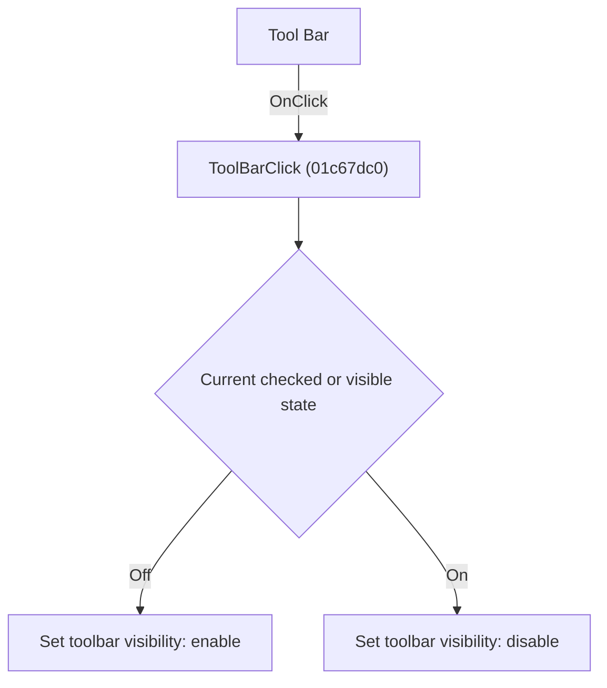

# Tool Bar

> Analysis status: Individually reviewed.

## Control

| Property | Recovered value |
| --- | --- |
| Form | SchematicEditor |
| Component path | SchematicEditor.ToolsPopup.ToolBar |
| Control class | TMenuItem |
| Caption | Tool Bar |
| Hint | Not present in the recovered resource. |
| Text | Not present in the recovered resource. |
| Handler name | ToolBarClick |
| Handler address | 01c67dc0 |
| Graph node | `resource:dfm:SchematicEditor/SchematicEditor.ToolsPopup.ToolBar` |
| Handler node | `function:01c67dc0` |
| Graph layer | UI |

## What happens when clicked

The handler reads the current toolbar visibility and applies the opposite value. A click therefore shows a hidden toolbar or hides a visible toolbar.

## Click flow

## Handler evidence

- Source: [DecompiledSources/Tina16/functions/0000000001C67DC0__FUN_01c67dc0.c](../../../DecompiledSources/Tina16/functions/0000000001C67DC0__FUN_01c67dc0.c)
- Recovered role: Toggle the main toolbar.
- Current graph summary: Handles 1 Delphi UI event: SchematicEditor.ToolsPopup.ToolBar.OnClick.
- Current graph behavior: The handler reads the current toolbar visibility and applies the opposite value. A click therefore shows a hidden toolbar or hides a visible toolbar.
- Current graph evidence: The recovered body negates the visible byte of the toolbar field and calls its visibility setter. The ToolsPopup.ToolBar resource supplies the Tool Bar caption.
- Complexity: simple
- Distinct outgoing calls: 1

## Direct calls

- `function:0064dbe0` — FUN_0064dbe0

## Resource evidence

- Kind: Not present in the recovered resource.
- Modal result: Not present in the recovered resource.
- Checked state: true
- List items: Not present in the recovered resource.
- Image reference: Not present in the recovered resource.
- Extracted glyph: None.

## Nearby label candidates

Nearby labels are layout candidates only. They are not proof of behavior.

- No same-parent label candidate is available.

## Analysis limits

- The recovered source exposes the toolbar field by offset, not by Delphi field name.

