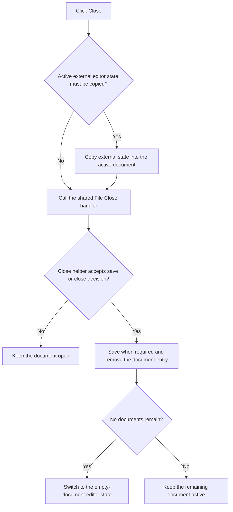

# Close

> Analysis status: Complete.

## Control

| Property | Recovered value |
| --- | --- |
| Form | SchematicEditor |
| Component path | SchematicEditor.TopToolBar.GeneralTools.ToolClose |
| Control class | TSpeedButton |
| Hint | Close (Ctrl+F4) |
| Handler | `ToolCloseClick` at `01c98960` |
| Graph nodes | `resource:dfm:SchematicEditor/SchematicEditor.TopToolBar.GeneralTools.ToolClose` → `function:01c98960` |
| Graph layer | UI |

## What happens when clicked

The handler first checks an optional external editor object. When it is active, ready, and the current document type is `2`, it copies the external object's current selection or state into the active document's subordinate object through a virtual method.

It then delegates to `FUN_01c94450`, the same close path used by `MainMenu.mnFile.mnClose`. That helper locates the active document entry, prepares its schematic collection, finds the matching document index, and calls `FUN_01c94060`. The close helper can prompt for an unsaved or externally changed document. Cancel keeps the document open. An accepted close saves when required, removes the document entry, and switches the editor to its empty-document state when the document list becomes empty.

The toolbar handler has no independent retry or local exception block. All save and cancel decisions are in the shared close path.

## Click flow

## Evidence

- Toolbar handler: [FUN_01c98960](../../../DecompiledSources/Tina16/functions/0000000001C98960__FUN_01c98960.c)
- Shared File Close handler: [FUN_01c94450](../../../DecompiledSources/Tina16/functions/0000000001C94450__FUN_01c94450.c)
- Document close and prompt path: [FUN_01c94060](../../../DecompiledSources/Tina16/functions/0000000001C94060__FUN_01c94060.c)
- Extracted glyph: [Close glyph](../../../glyph/0358_SchematicEditor_SchematicEditor_TopToolBar_GeneralTools_ToolClose_Glyph_Data.png)
- Recovered role: Synchronize optional external state and close the active Schematic Editor document through the shared File Close path.

## Analysis limits

- The external editor object and document-type enumeration names are not recovered.
