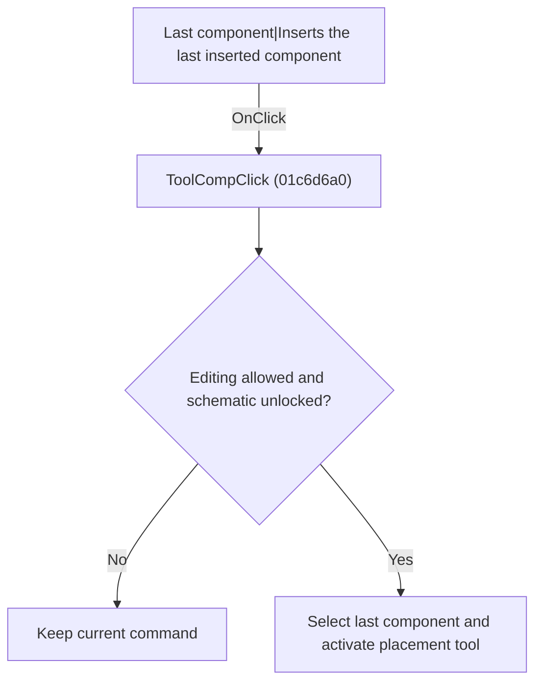

# Last component|Inserts the last inserted component

> Analysis status: Individually reviewed.

## Control

| Property | Recovered value |
| --- | --- |
| Form | SchematicEditor |
| Component path | SchematicEditor.TopToolBar.EditorTools.ToolComp |
| Control class | TSpeedButton |
| Caption | Not present in the recovered resource. |
| Hint | Last component\|Inserts the last inserted component |
| Text | Not present in the recovered resource. |
| Handler name | ToolCompClick |
| Handler address | 01c6d6a0 |
| Graph node | `resource:dfm:SchematicEditor/SchematicEditor.TopToolBar.EditorTools.ToolComp` |
| Handler node | `function:01c6d6a0` |
| Graph layer | UI |

## What happens when clicked

If editing is allowed and the schematic is not locked, the handler asks the component selector for the last-used component and activates the component tool. If either guard fails, it leaves the active command unchanged.

## Click flow

## Handler evidence

- Source: [DecompiledSources/Tina16/functions/0000000001C6D6A0__FUN_01c6d6a0.c](../../../DecompiledSources/Tina16/functions/0000000001C6D6A0__FUN_01c6d6a0.c)
- Recovered role: Select the last component placement tool.
- Current graph summary: Handles 1 Delphi UI event: SchematicEditor.TopToolBar.EditorTools.ToolComp.OnClick.
- Current graph behavior: If editing is allowed and the schematic is not locked, the handler asks the component selector for the last-used component and activates the component tool. If either guard fails, it leaves the active command unchanged.
- Current graph evidence: The recovered body checks the shared command-permission helper and the document lock byte, calls FUN_01c6ec30 with index -1, and activates the bound tool button through FUN_01c6d670.
- Complexity: complex
- Distinct outgoing calls: 3

## Direct calls

- `function:01c6d670` — FUN_01c6d670
- `function:01c6ec30` — FUN_01c6ec30
- `function:01c8cee0` — FUN_01c8cee0

## Resource evidence

- Kind: Not present in the recovered resource.
- Modal result: Not present in the recovered resource.
- Checked state: Not present in the recovered resource.
- List items: Not present in the recovered resource.
- Image reference: Not present in the recovered resource.
- Extracted glyph: [`0342_SchematicEditor_SchematicEditor_TopToolBar_EditorTools_ToolComp_Glyph_Data.png`](../../../glyph/0342_SchematicEditor_SchematicEditor_TopToolBar_EditorTools_ToolComp_Glyph_Data.png)

## Nearby label candidates

Nearby labels are layout candidates only. They are not proof of behavior.

- No same-parent label candidate is available.

## Analysis limits

- The selected component type is runtime state and is not fixed by this control.

