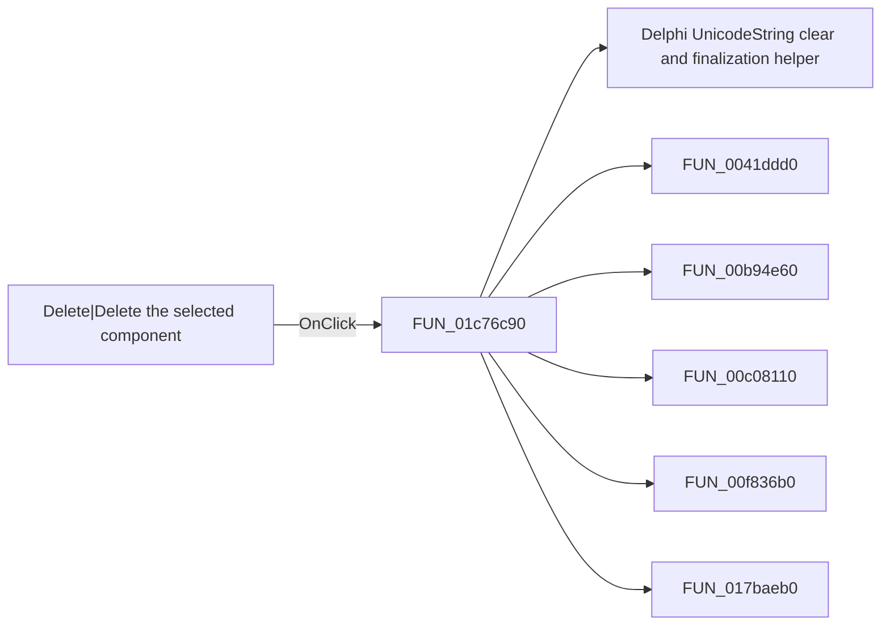

# Delete|Delete the selected component

> Analysis status: Pending individual source review.

## Control

| Property | Recovered value |
| --- | --- |
| Form | SchematicEditor |
| Component path | SchematicEditor.TopToolBar.EditorTools.ToolDelete |
| Control class | TSpeedButton |
| Caption | Not present in the recovered resource. |
| Hint | Delete\|Delete the selected component |
| Text | Not present in the recovered resource. |
| Handler name | mnDeleteClick |
| Handler address | 01c76c90 |
| Graph node | `resource:dfm:SchematicEditor/SchematicEditor.TopToolBar.EditorTools.ToolDelete` |
| Handler node | `function:01c76c90` |
| Graph layer | UI |

## What happens when clicked

Pending individual analysis. An agent must read the recovered handler source and its relevant callees before it replaces this text.

## Click flow

## Handler evidence

- Source: [DecompiledSources/Tina16/functions/0000000001C76C90__FUN_01c76c90.c](../../../DecompiledSources/Tina16/functions/0000000001C76C90__FUN_01c76c90.c)
- Recovered role: Not present in the recovered resource.
- Current graph summary: Handles 3 Delphi UI events: SchematicEditor.TopToolBar.EditorTools.ToolDelete.OnClick, SchematicEditor.MainMenu.Edit.mnDelete.OnClick, SchematicEditor.SchPopup.pmDelete.OnClick.
- Current graph behavior: Not present in the recovered resource.
- Current graph evidence: Not present in the recovered resource.
- Complexity: complex
- Distinct outgoing calls: 16

## Direct calls

- `function:00414480` — Delphi UnicodeString clear and finalization helper
- `function:0041ddd0` — FUN_0041ddd0
- `function:00b94e60` — FUN_00b94e60
- `function:00c08110` — FUN_00c08110
- `function:00f836b0` — FUN_00f836b0
- `function:017baeb0` — FUN_017baeb0
- `function:017baf00` — FUN_017baf00
- `function:017bb120` — FUN_017bb120
- `function:01993e20` — FUN_01993e20
- `function:01993ec0` — FUN_01993ec0
- `function:019946d0` — FUN_019946d0
- `function:0199e310` — FUN_0199e310
- `function:01c76c50` — FUN_01c76c50
- `function:01c87d20` — FUN_01c87d20
- `function:01c8cee0` — FUN_01c8cee0
- `function:01d3bd80` — FUN_01d3bd80

## Resource evidence

- Kind: Not present in the recovered resource.
- Modal result: Not present in the recovered resource.
- Checked state: Not present in the recovered resource.
- List items: Not present in the recovered resource.
- Image reference: Not present in the recovered resource.
- Extracted glyph: [`0349_SchematicEditor_SchematicEditor_TopToolBar_EditorTools_ToolDelete_Glyph_Data.png`](../../../glyph/0349_SchematicEditor_SchematicEditor_TopToolBar_EditorTools_ToolDelete_Glyph_Data.png)

## Nearby label candidates

Nearby labels are layout candidates only. They are not proof of behavior.

- No same-parent label candidate is available.

## Analysis limits

- Do not infer behavior from the control class, caption, hint, glyph, or nearby label alone.
- Do not replace the pending status until the handler source and relevant call path provide enough evidence.
