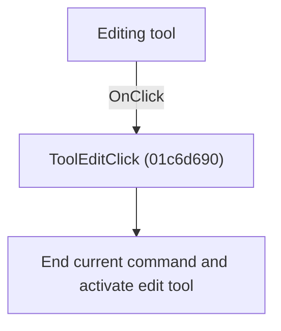

# Editing tool

> Analysis status: Individually reviewed.

## Control

| Property | Recovered value |
| --- | --- |
| Form | SchematicEditor |
| Component path | SchematicEditor.TopToolBar.EditorTools.ToolEdit |
| Control class | TSpeedButton |
| Caption | Not present in the recovered resource. |
| Hint | Editing tool |
| Text | Not present in the recovered resource. |
| Handler name | ToolEditClick |
| Handler address | 01c6d690 |
| Graph node | `resource:dfm:SchematicEditor/SchematicEditor.TopToolBar.EditorTools.ToolEdit` |
| Handler node | `function:01c6d690` |
| Graph layer | UI |

## What happens when clicked

The handler ends and destroys the current interactive command, clears its field, and marks the edit tool as active.

## Click flow

## Handler evidence

- Source: [DecompiledSources/Tina16/functions/0000000001C6D690__FUN_01c6d690.c](../../../DecompiledSources/Tina16/functions/0000000001C6D690__FUN_01c6d690.c)
- Recovered role: Return to the schematic edit tool.
- Current graph summary: Handles 1 Delphi UI event: SchematicEditor.TopToolBar.EditorTools.ToolEdit.OnClick.
- Current graph behavior: The handler ends and destroys the current interactive command, clears its field, and marks the edit tool as active.
- Current graph evidence: The handler delegates to FUN_01c6cf20. That recovered callee destroys the active command at form offset 0x1b58, clears the pointer, and calls the tool-button activation helper for the edit tool.
- Complexity: simple
- Distinct outgoing calls: 1

## Direct calls

- `function:01c6cf20` — FUN_01c6cf20

## Resource evidence

- Kind: Not present in the recovered resource.
- Modal result: Not present in the recovered resource.
- Checked state: Not present in the recovered resource.
- List items: Not present in the recovered resource.
- Image reference: Not present in the recovered resource.
- Extracted glyph: [`0343_SchematicEditor_SchematicEditor_TopToolBar_EditorTools_ToolEdit_Glyph_Data.png`](../../../glyph/0343_SchematicEditor_SchematicEditor_TopToolBar_EditorTools_ToolEdit_Glyph_Data.png)

## Nearby label candidates

Nearby labels are layout candidates only. They are not proof of behavior.

- No same-parent label candidate is available.

## Analysis limits

- The active-command field is recovered only by offset.

