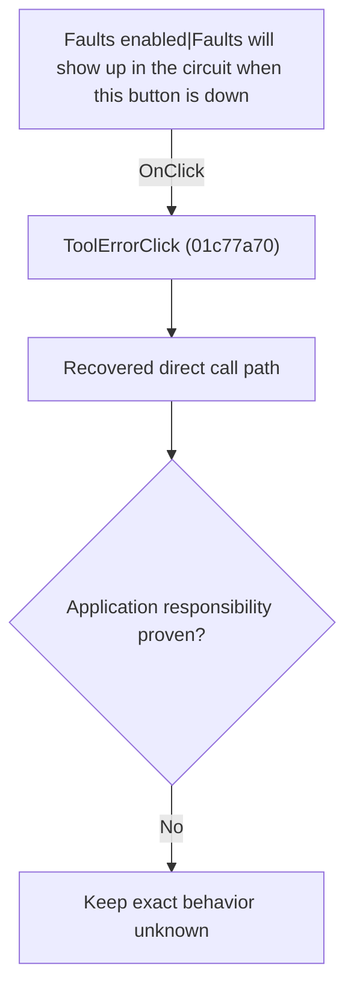

# Faults enabled|Faults will show up in the circuit when this button is down

> Analysis status: Blocked by an exact evidence gap.

## Control

| Property | Recovered value |
| --- | --- |
| Form | SchematicEditor |
| Component path | SchematicEditor.TopToolBar.EditorTools.ToolError |
| Control class | TSpeedButton |
| Caption | Not present in the recovered resource. |
| Hint | Faults enabled\|Faults will show up in the circuit when this button is down |
| Text | Not present in the recovered resource. |
| Handler name | ToolErrorClick |
| Handler address | 01c77a70 |
| Graph node | `resource:dfm:SchematicEditor/SchematicEditor.TopToolBar.EditorTools.ToolError` |
| Handler node | `function:01c77a70` |
| Graph layer | UI |

## What happens when clicked

The OnClick binding reaches ToolErrorClick at 01c77a70. The recovered body has 2 distinct outgoing graph call(s), but the application-specific responsibilities and data effects of its downstream path are not established in the accepted graph evidence. The control's caption or name indicates user intent only; it is not enough to claim implementation behavior.

## Click flow

## Handler evidence

- Source: [DecompiledSources/Tina16/functions/0000000001C77A70__FUN_01c77a70.c](../../../DecompiledSources/Tina16/functions/0000000001C77A70__FUN_01c77a70.c)
- Recovered role: Evidence-blocked ToolErrorClick command.
- Current graph summary: Handles 1 Delphi UI event: SchematicEditor.TopToolBar.EditorTools.ToolError.OnClick.
- Current graph behavior: The OnClick binding reaches ToolErrorClick at 01c77a70. The recovered body has 2 distinct outgoing graph call(s), but the application-specific responsibilities and data effects of its downstream path are not established in the accepted graph evidence. The control's caption or name indicates user intent only; it is not enough to claim implementation behavior.
- Current graph evidence: The DFM binds SchematicEditor.TopToolBar.EditorTools.ToolError to ToolErrorClick. The recovered source is DecompiledSources/Tina16/functions/0000000001C77A70__FUN_01c77a70.c and directly references 0082a6c0, 01c779c0. No accepted end-to-end role was established for this control path.
- Complexity: moderate
- Distinct outgoing calls: 2

## Direct calls

- `function:0082a6c0` — FUN_0082a6c0
- `function:01c779c0` — FUN_01c779c0

## Resource evidence

- Kind: Not present in the recovered resource.
- Modal result: Not present in the recovered resource.
- Checked state: Not present in the recovered resource.
- List items: Not present in the recovered resource.
- Image reference: Not present in the recovered resource.
- Extracted glyph: [`0333_SchematicEditor_SchematicEditor_TopToolBar_EditorTools_ToolError_Glyph_Data.png`](../../../glyph/0333_SchematicEditor_SchematicEditor_TopToolBar_EditorTools_ToolError_Glyph_Data.png)

## Nearby label candidates

Nearby labels are layout candidates only. They are not proof of behavior.

- No same-parent label candidate is available.

## Analysis limits

- Exact gap: the recovered handler or one of its direct application callees lacks a source-supported role that proves the command's decisions, state changes, and output. Keep this Bead open until those callees are traced.

