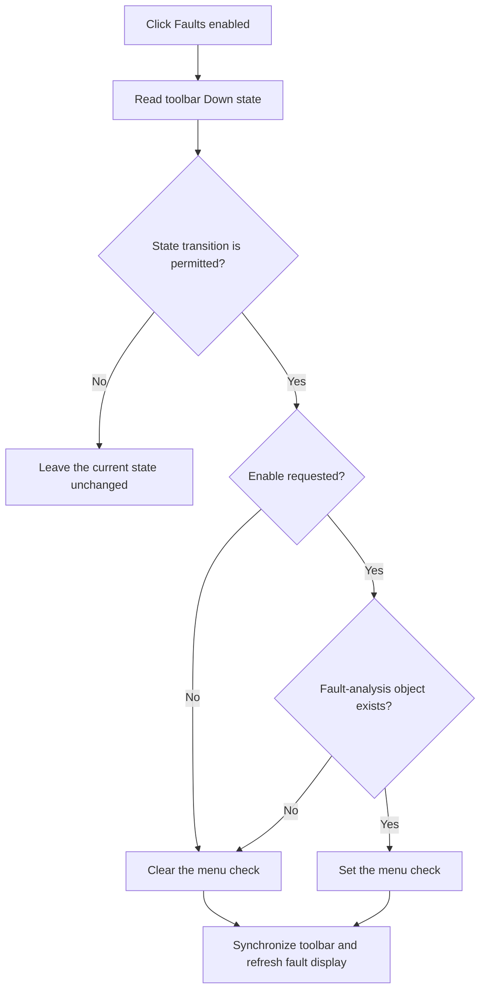

# Faults enabled

> Analysis status: Complete.

## Control

| Property | Recovered value |
| --- | --- |
| Form | SchematicEditor |
| Component path | SchematicEditor.TopToolBar.EditorTools.ToolError |
| Control class | TSpeedButton |
| Hint | Faults enabled\|Faults will show up in the circuit when this button is down |
| Handler | `ToolErrorClick` at `01c77a70` |
| Graph nodes | `resource:dfm:SchematicEditor/SchematicEditor.TopToolBar.EditorTools.ToolError` → `function:01c77a70` |
| Graph layer | UI |

## What happens when clicked

The handler reads the toolbar button's Down state and passes it to `FUN_01c779c0`. That helper can reject a change when an editor transition is already active and the requested state conflicts with the pending state.

For an accepted change, disabling always clears the related `Faults enabled` menu check. Enabling sets the menu check only when the active schematic supplies the required fault-analysis object. The helper then copies the menu's actual checked state back to the toolbar button and refreshes the fault display. The toolbar handler repeats the final button synchronization.

Thus, a failed enable request leaves both controls off. The handler shows no message and has no local exception block.

## Click flow

## Evidence

- Handler: [FUN_01c77a70](../../../DecompiledSources/Tina16/functions/0000000001C77A70__FUN_01c77a70.c)
- Shared state helper: [FUN_01c779c0](../../../DecompiledSources/Tina16/functions/0000000001C779C0__FUN_01c779c0.c)
- Parallel menu handler: [FUN_01c77a40](../../../DecompiledSources/Tina16/functions/0000000001C77A40__FUN_01c77a40.c)
- Fault-object lookup: [FUN_01c7da00](../../../DecompiledSources/Tina16/functions/0000000001C7DA00__FUN_01c7da00.c)
- Extracted glyph: [Fault toggle glyph](../../../glyph/0333_SchematicEditor_SchematicEditor_TopToolBar_EditorTools_ToolError_Glyph_Data.png)
- Recovered role: Toggle fault display when the active schematic supports it and synchronize menu and toolbar state.

## Analysis limits

- The fault-analysis object type and editor transition flag names are not recovered.
