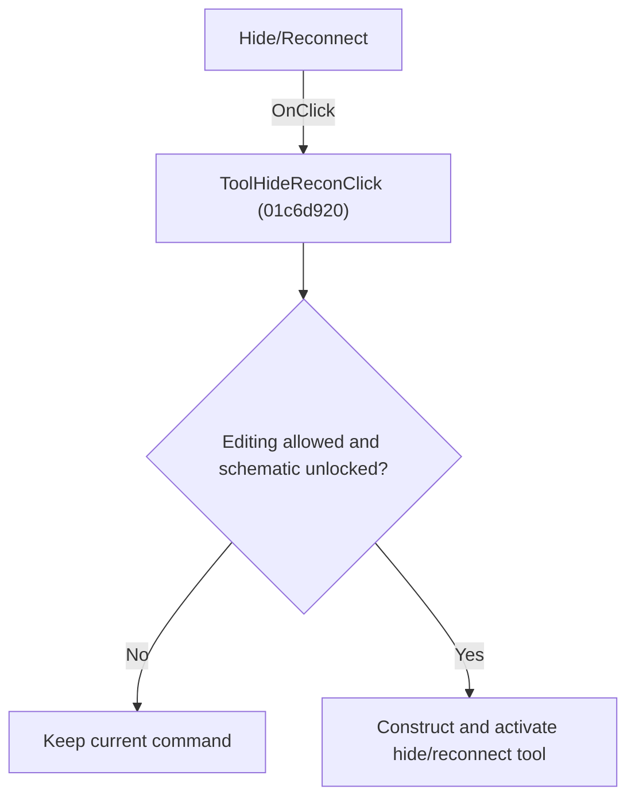

# Hide/Reconnect

> Analysis status: Individually reviewed.

## Control

| Property | Recovered value |
| --- | --- |
| Form | SchematicEditor |
| Component path | SchematicEditor.TopToolBar.EditorTools.ToolHideRecon |
| Control class | TSpeedButton |
| Caption | Not present in the recovered resource. |
| Hint | Hide/Reconnect |
| Text | Not present in the recovered resource. |
| Handler name | ToolHideReconClick |
| Handler address | 01c6d920 |
| Graph node | `resource:dfm:SchematicEditor/SchematicEditor.TopToolBar.EditorTools.ToolHideRecon` |
| Handler node | `function:01c6d920` |
| Graph layer | UI |

## What happens when clicked

If editing is allowed and the schematic is not locked, the handler constructs the hide/reconnect command, replaces the active command, and activates its toolbar button. Otherwise it leaves the command unchanged.

## Click flow

## Handler evidence

- Source: [DecompiledSources/Tina16/functions/0000000001C6D920__FUN_01c6d920.c](../../../DecompiledSources/Tina16/functions/0000000001C6D920__FUN_01c6d920.c)
- Recovered role: Activate the hide or reconnect tool.
- Current graph summary: Handles 1 Delphi UI event: SchematicEditor.TopToolBar.EditorTools.ToolHideRecon.OnClick.
- Current graph behavior: If editing is allowed and the schematic is not locked, the handler constructs the hide/reconnect command, replaces the active command, and activates its toolbar button. Otherwise it leaves the command unchanged.
- Current graph evidence: The body uses the shared permission and lock guards, constructs a distinct command class, passes it to FUN_01c6cee0, and calls FUN_01c6d670 for the bound tool button.
- Complexity: complex
- Distinct outgoing calls: 4

## Direct calls

- `function:01364e80` — FUN_01364e80
- `function:01c6cee0` — FUN_01c6cee0
- `function:01c6d670` — FUN_01c6d670
- `function:01c8cee0` — FUN_01c8cee0

## Resource evidence

- Kind: Not present in the recovered resource.
- Modal result: Not present in the recovered resource.
- Checked state: Not present in the recovered resource.
- List items: Not present in the recovered resource.
- Image reference: Not present in the recovered resource.
- Extracted glyph: [`0339_SchematicEditor_SchematicEditor_TopToolBar_EditorTools_ToolHideRecon_Glyph_Data.png`](../../../glyph/0339_SchematicEditor_SchematicEditor_TopToolBar_EditorTools_ToolHideRecon_Glyph_Data.png)

## Nearby label candidates

Nearby labels are layout candidates only. They are not proof of behavior.

- No same-parent label candidate is available.

## Analysis limits

- The command class name is not present in the recovered symbols.

