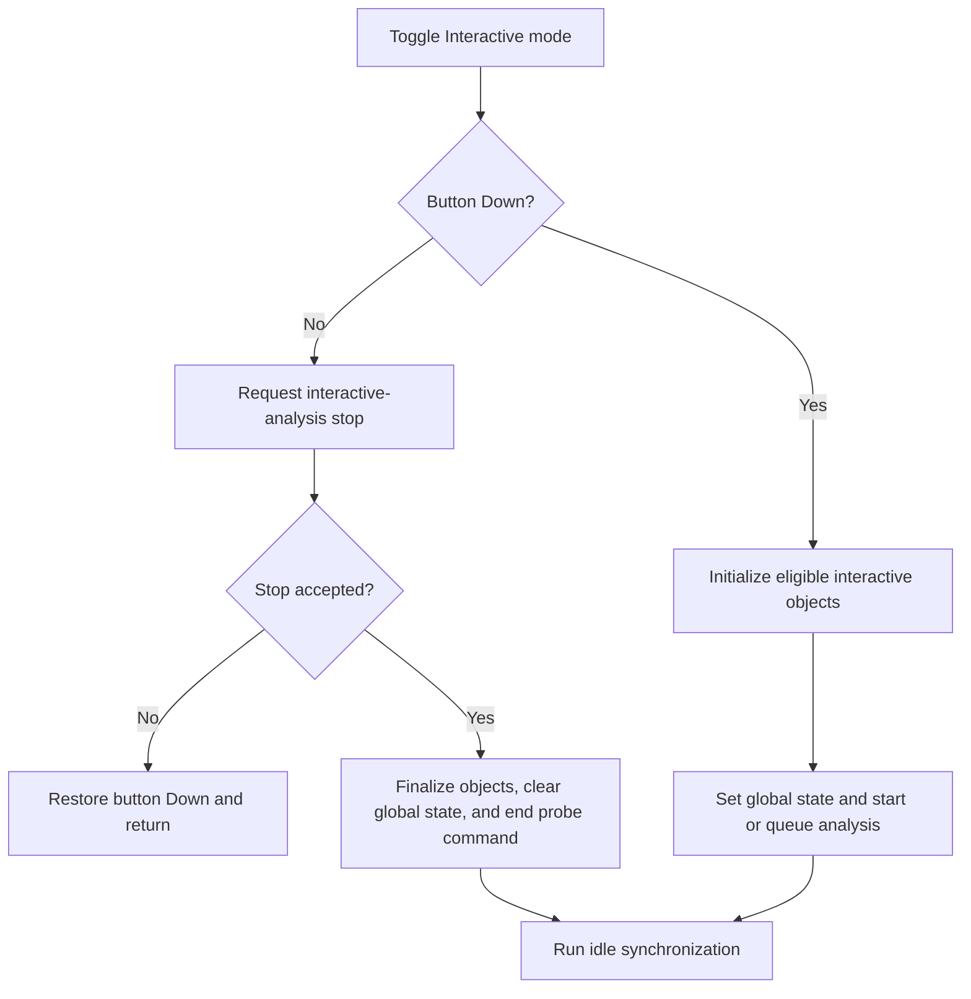

# Interactive mode On/Off

> Analysis status: Complete.

## Control

| Property | Recovered value |
| --- | --- |
| Form | SchematicEditor |
| Component path | SchematicEditor.TopToolBar.EditorTools.ToolInteractive |
| Control class | TSpeedButton |
| Hint | Interactive mode On/Off |
| Handler | `ToolInteractiveClick` at `01c87e40` |
| Graph nodes | `resource:dfm:SchematicEditor/SchematicEditor.TopToolBar.EditorTools.ToolInteractive` → `function:01c87e40` |
| Graph layer | UI |

## What happens when clicked

The handler clears the current interactive-object field at `+0x1838` and branches on the speed button's Down state.

When Down is false, it asks `FUN_01c88130` to stop an active interactive analysis. If that helper rejects the stop, the handler restores Down to true and returns. Otherwise, it finalizes interactive state for every schematic object, stops the related analysis service, clears the global interactive flag, swaps the two interaction-state controls, and ends an active probe command when its class matches VMT `01362bd8`.

When Down is true, it initializes eligible interactive schematic objects when required, sets the global interactive flag, swaps the interaction-state controls, and starts the configured analysis. Depending on the current analysis state, it either calls the transition helper directly or queues this handler for a later retry. After a normal path, it calls the Schematic Editor idle handler to synchronize the UI.

The handler does not show a message and has no local exception block. A rejected stop is the explicit fallback: it restores the pressed state.

## Click flow

## Evidence

- Handler: [FUN_01c87e40](../../../DecompiledSources/Tina16/functions/0000000001C87E40__FUN_01c87e40.c)
- Analysis transition helper: [FUN_01c88130](../../../DecompiledSources/Tina16/functions/0000000001C88130__FUN_01c88130.c)
- Object finalization: [FUN_01c87cc0](../../../DecompiledSources/Tina16/functions/0000000001C87CC0__FUN_01c87cc0.c)
- Interactive-object discovery: [FUN_01c87db0](../../../DecompiledSources/Tina16/functions/0000000001C87DB0__FUN_01c87db0.c)
- Extracted glyph: [Interactive-mode glyph](../../../glyph/0344_SchematicEditor_SchematicEditor_TopToolBar_EditorTools_ToolInteractive_Glyph_Data.png)
- Recovered role: Start or stop interactive analysis and synchronize its editor controls.

## Analysis limits

- Several global analysis-state values are numeric and do not have recovered Delphi enumeration names.
