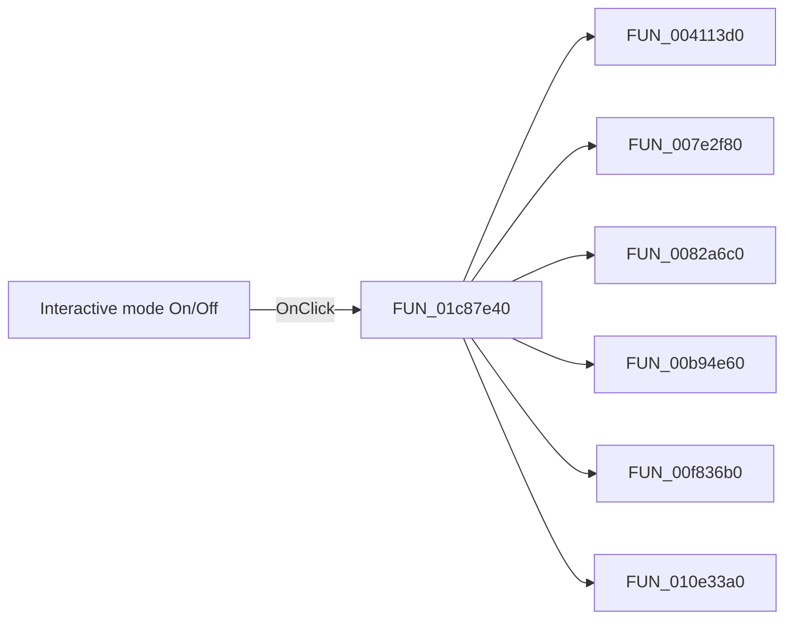

# Interactive mode On/Off

> Analysis status: Pending individual source review.

## Control

| Property | Recovered value |
| --- | --- |
| Form | SchematicEditor |
| Component path | SchematicEditor.TopToolBar.EditorTools.ToolInteractive |
| Control class | TSpeedButton |
| Caption | Not present in the recovered resource. |
| Hint | Interactive mode On/Off |
| Text | Not present in the recovered resource. |
| Handler name | ToolInteractiveClick |
| Handler address | 01c87e40 |
| Graph node | `resource:dfm:SchematicEditor/SchematicEditor.TopToolBar.EditorTools.ToolInteractive` |
| Handler node | `function:01c87e40` |
| Graph layer | UI |

## What happens when clicked

Pending individual analysis. An agent must read the recovered handler source and its relevant callees before it replaces this text.

## Click flow

## Handler evidence

- Source: [DecompiledSources/Tina16/functions/0000000001C87E40__FUN_01c87e40.c](../../../DecompiledSources/Tina16/functions/0000000001C87E40__FUN_01c87e40.c)
- Recovered role: Not present in the recovered resource.
- Current graph summary: Handles 1 Delphi UI event: SchematicEditor.TopToolBar.EditorTools.ToolInteractive.OnClick.
- Current graph behavior: Not present in the recovered resource.
- Current graph evidence: Not present in the recovered resource.
- Complexity: complex
- Distinct outgoing calls: 13

## Direct calls

- `function:004113d0` — FUN_004113d0
- `function:007e2f80` — FUN_007e2f80
- `function:0082a6c0` — FUN_0082a6c0
- `function:00b94e60` — FUN_00b94e60
- `function:00f836b0` — FUN_00f836b0
- `function:010e33a0` — FUN_010e33a0
- `function:01359540` — FUN_01359540
- `function:0135b2b0` — FUN_0135b2b0
- `function:01c6cf20` — FUN_01c6cf20
- `function:01c7ec30` — Handles 1 Delphi UI event: SchematicEditor.SchematicEditorEvents.OnIdle.
- `function:01c87cc0` — FUN_01c87cc0
- `function:01c87db0` — FUN_01c87db0
- `function:01c88130` — FUN_01c88130

## Resource evidence

- Kind: Not present in the recovered resource.
- Modal result: Not present in the recovered resource.
- Checked state: Not present in the recovered resource.
- List items: Not present in the recovered resource.
- Image reference: Not present in the recovered resource.
- Extracted glyph: [`0344_SchematicEditor_SchematicEditor_TopToolBar_EditorTools_ToolInteractive_Glyph_Data.png`](../../../glyph/0344_SchematicEditor_SchematicEditor_TopToolBar_EditorTools_ToolInteractive_Glyph_Data.png)

## Nearby label candidates

Nearby labels are layout candidates only. They are not proof of behavior.

- No same-parent label candidate is available.

## Analysis limits

- Do not infer behavior from the control class, caption, hint, glyph, or nearby label alone.
- Do not replace the pending status until the handler source and relevant call path provide enough evidence.
