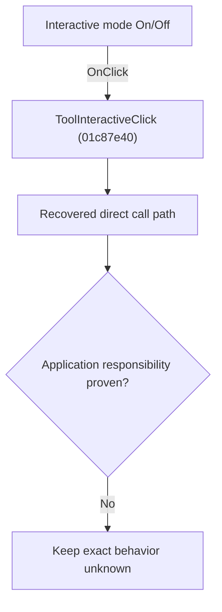

# Interactive mode On/Off

> Analysis status: Blocked by an exact evidence gap.

## Control

| Property | Recovered value |
| --- | --- |
| Form | SchematicEditor |
| Component path | SchematicEditor.TopToolBar.EditorTools.ToolInteractive |
| Control class | TSpeedButton |
| Caption | Not present in the recovered resource. |
| Hint | Interactive mode On/Off |
| Text | Not present in the recovered resource. |
| Handler name | ToolInteractiveClick |
| Handler address | 01c87e40 |
| Graph node | `resource:dfm:SchematicEditor/SchematicEditor.TopToolBar.EditorTools.ToolInteractive` |
| Handler node | `function:01c87e40` |
| Graph layer | UI |

## What happens when clicked

The OnClick binding reaches ToolInteractiveClick at 01c87e40. The recovered body has 13 distinct outgoing graph call(s), but the application-specific responsibilities and data effects of its downstream path are not established in the accepted graph evidence. The control's caption or name indicates user intent only; it is not enough to claim implementation behavior.

## Click flow

## Handler evidence

- Source: [DecompiledSources/Tina16/functions/0000000001C87E40__FUN_01c87e40.c](../../../DecompiledSources/Tina16/functions/0000000001C87E40__FUN_01c87e40.c)
- Recovered role: Evidence-blocked ToolInteractiveClick command.
- Current graph summary: Handles 1 Delphi UI event: SchematicEditor.TopToolBar.EditorTools.ToolInteractive.OnClick.
- Current graph behavior: The OnClick binding reaches ToolInteractiveClick at 01c87e40. The recovered body has 13 distinct outgoing graph call(s), but the application-specific responsibilities and data effects of its downstream path are not established in the accepted graph evidence. The control's caption or name indicates user intent only; it is not enough to claim implementation behavior.
- Current graph evidence: The DFM binds SchematicEditor.TopToolBar.EditorTools.ToolInteractive to ToolInteractiveClick. The recovered source is DecompiledSources/Tina16/functions/0000000001C87E40__FUN_01c87e40.c and directly references 004113d0, 007e2f80, 0082a6c0, 00b94e60, 00f836b0, 010e33a0, 01359540, 0135b2b0, and 5 more. No accepted end-to-end role was established for this control path.
- Complexity: complex
- Distinct outgoing calls: 13

## Direct calls

- `function:004113d0` — FUN_004113d0
- `function:007e2f80` — FUN_007e2f80
- `function:0082a6c0` — FUN_0082a6c0
- `function:00b94e60` — FUN_00b94e60
- `function:00f836b0` — FUN_00f836b0
- `function:010e33a0` — FUN_010e33a0
- `function:01359540` — FUN_01359540
- `function:0135b2b0` — FUN_0135b2b0
- `function:01c6cf20` — FUN_01c6cf20
- `function:01c7ec30` — Handles 1 Delphi UI event: SchematicEditor.SchematicEditorEvents.OnIdle.
- `function:01c87cc0` — FUN_01c87cc0
- `function:01c87db0` — FUN_01c87db0
- `function:01c88130` — FUN_01c88130

## Resource evidence

- Kind: Not present in the recovered resource.
- Modal result: Not present in the recovered resource.
- Checked state: Not present in the recovered resource.
- List items: Not present in the recovered resource.
- Image reference: Not present in the recovered resource.
- Extracted glyph: [`0344_SchematicEditor_SchematicEditor_TopToolBar_EditorTools_ToolInteractive_Glyph_Data.png`](../../../glyph/0344_SchematicEditor_SchematicEditor_TopToolBar_EditorTools_ToolInteractive_Glyph_Data.png)

## Nearby label candidates

Nearby labels are layout candidates only. They are not proof of behavior.

- No same-parent label candidate is available.

## Analysis limits

- Exact gap: the recovered handler or one of its direct application callees lacks a source-supported role that proves the command's decisions, state changes, and output. Keep this Bead open until those callees are traced.

