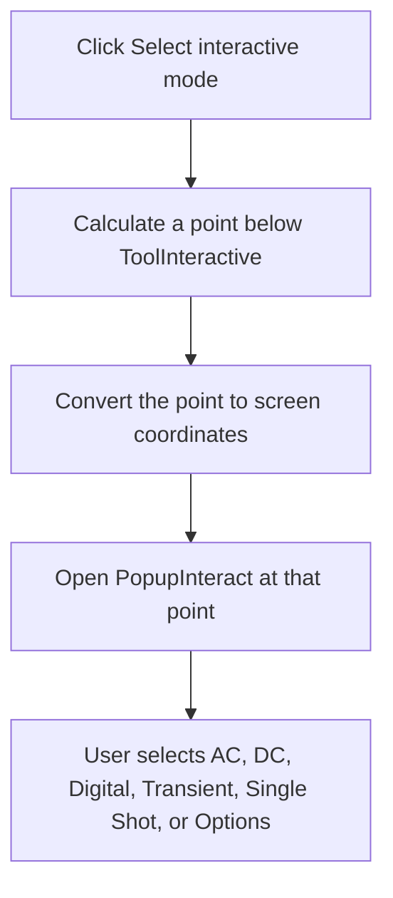

# Select interactive mode

> Analysis status: Complete.

## Control

| Property | Recovered value |
| --- | --- |
| Form | SchematicEditor |
| Component path | SchematicEditor.TopToolBar.EditorTools.ToolInteractModeSelect |
| Control class | TSpeedButton |
| Hint | Select interactive mode |
| Handler | `ToolInteractModeSelectClick` at `01c898a0` |
| Graph nodes | `resource:dfm:SchematicEditor/SchematicEditor.TopToolBar.EditorTools.ToolInteractModeSelect` → `function:01c898a0` |
| Graph layer | UI |

## What happens when clicked

The handler prepares `SchematicEditor.PopupInteract` for an explicit pop-up request. It calculates a point two pixels below the `ToolInteractive` button, converts that point from control coordinates to screen coordinates, and opens the pop-up menu there.

The recovered pop-up contains AC, DC, Digital, Transient, Transient Single Shot, and Options entries. This click does not itself change the interactive mode. A later menu-item handler performs that change. There is no position fallback, message, or local exception block.

## Click flow

## Evidence

- Handler: [FUN_01c898a0](../../../DecompiledSources/Tina16/functions/0000000001C898A0__FUN_01c898a0.c)
- Coordinate conversion: [FUN_0064d1f0](../../../DecompiledSources/Tina16/functions/000000000064D1F0__FUN_0064d1f0.c)
- Resource: `SchematicEditor.PopupInteract` and its recovered menu children.
- Extracted glyph: [Interactive-mode selector glyph](../../../glyph/0345_SchematicEditor_SchematicEditor_TopToolBar_EditorTools_ToolInteractModeSelect_Glyph_Data.png)
- Recovered role: Open the interactive-mode pop-up below the toolbar control.

## Analysis limits

- The indirect VCL pop-up method name is not recovered. Its coordinate inputs and `PopupInteract` resource identity establish the operation.
