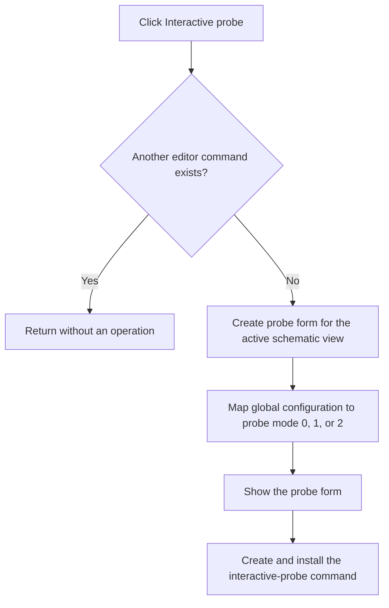

# Interactive probe

> Analysis status: Complete.

## Control

| Property | Recovered value |
| --- | --- |
| Form | SchematicEditor |
| Component path | SchematicEditor.TopToolBar.EditorTools.ToolIntProbe |
| Control class | TSpeedButton |
| Hint | Interactive probe |
| Handler | `ToolIntProbeClick` at `01c9c130` |
| Graph nodes | `resource:dfm:SchematicEditor/SchematicEditor.TopToolBar.EditorTools.ToolIntProbe` → `function:01c9c130` |
| Graph layer | UI |

## What happens when clicked

The handler starts only when the current-command field at form offset `+0x1b58` is null. If another command exists, the click is a no-op.

When the field is null, the handler creates an interactive-probe form with the active schematic view at record offset `+0x488`. It stores the form globally, maps configuration byte `+0x813` to probe mode `0`, `1`, or `2`, clears another form state byte at `+0x6e0`, and shows the form. It then ends the current editor command state, creates command class VMT `01362bd8`, and installs that object as the active editor command.

The handler does not validate the active schematic pointer locally and has no message, retry, or local exception block. Normal UI enablement must keep that input valid.

## Click flow

## Evidence

- Handler: [FUN_01c9c130](../../../DecompiledSources/Tina16/functions/0000000001C9C130__FUN_01c9c130.c)
- Current-command shutdown: [FUN_01c6cf20](../../../DecompiledSources/Tina16/functions/0000000001C6CF20__FUN_01c6cf20.c)
- Extracted glyph: [Interactive probe glyph](../../../glyph/0348_SchematicEditor_SchematicEditor_TopToolBar_EditorTools_ToolIntProbe_Glyph_Data.png)
- Recovered role: Show the interactive-probe form and install its editor command.

## Analysis limits

- The probe form and command class names are not recovered from these function sources; their exact VMT addresses and field data flow are available.
