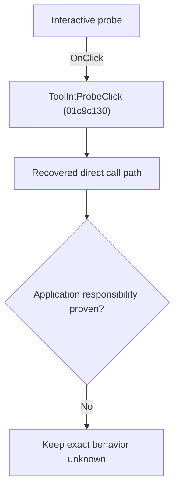

# Interactive probe

> Analysis status: Blocked by an exact evidence gap.

## Control

| Property | Recovered value |
| --- | --- |
| Form | SchematicEditor |
| Component path | SchematicEditor.TopToolBar.EditorTools.ToolIntProbe |
| Control class | TSpeedButton |
| Caption | Not present in the recovered resource. |
| Hint | Interactive probe |
| Text | Not present in the recovered resource. |
| Handler name | ToolIntProbeClick |
| Handler address | 01c9c130 |
| Graph node | `resource:dfm:SchematicEditor/SchematicEditor.TopToolBar.EditorTools.ToolIntProbe` |
| Handler node | `function:01c9c130` |
| Graph layer | UI |

## What happens when clicked

The OnClick binding reaches ToolIntProbeClick at 01c9c130. The recovered body has 5 distinct outgoing graph call(s), but the application-specific responsibilities and data effects of its downstream path are not established in the accepted graph evidence. The control's caption or name indicates user intent only; it is not enough to claim implementation behavior.

## Click flow

## Handler evidence

- Source: [DecompiledSources/Tina16/functions/0000000001C9C130__FUN_01c9c130.c](../../../DecompiledSources/Tina16/functions/0000000001C9C130__FUN_01c9c130.c)
- Recovered role: Evidence-blocked ToolIntProbeClick command.
- Current graph summary: Handles 1 Delphi UI event: SchematicEditor.TopToolBar.EditorTools.ToolIntProbe.OnClick.
- Current graph behavior: The OnClick binding reaches ToolIntProbeClick at 01c9c130. The recovered body has 5 distinct outgoing graph call(s), but the application-specific responsibilities and data effects of its downstream path are not established in the accepted graph evidence. The control's caption or name indicates user intent only; it is not enough to claim implementation behavior.
- Current graph evidence: The DFM binds SchematicEditor.TopToolBar.EditorTools.ToolIntProbe to ToolIntProbeClick. The recovered source is DecompiledSources/Tina16/functions/0000000001C9C130__FUN_01c9c130.c and directly references 008059a0, 00f4cc90, 0136aba0, 01c6cee0, 01c6cf20. No accepted end-to-end role was established for this control path.
- Complexity: complex
- Distinct outgoing calls: 5

## Direct calls

- `function:008059a0` — FUN_008059a0
- `function:00f4cc90` — FUN_00f4cc90
- `function:0136aba0` — FUN_0136aba0
- `function:01c6cee0` — FUN_01c6cee0
- `function:01c6cf20` — FUN_01c6cf20

## Resource evidence

- Kind: Not present in the recovered resource.
- Modal result: Not present in the recovered resource.
- Checked state: Not present in the recovered resource.
- List items: Not present in the recovered resource.
- Image reference: Not present in the recovered resource.
- Extracted glyph: [`0348_SchematicEditor_SchematicEditor_TopToolBar_EditorTools_ToolIntProbe_Glyph_Data.png`](../../../glyph/0348_SchematicEditor_SchematicEditor_TopToolBar_EditorTools_ToolIntProbe_Glyph_Data.png)

## Nearby label candidates

Nearby labels are layout candidates only. They are not proof of behavior.

- No same-parent label candidate is available.

## Analysis limits

- Exact gap: the recovered handler or one of its direct application callees lacks a source-supported role that proves the command's decisions, state changes, and output. Keep this Bead open until those callees are traced.

