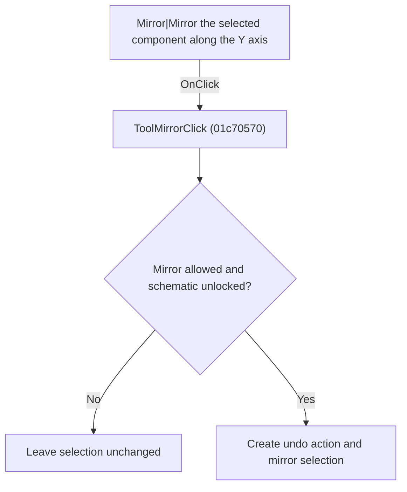

# Mirror|Mirror the selected component along the Y axis

> Analysis status: Individually reviewed.

## Control

| Property | Recovered value |
| --- | --- |
| Form | SchematicEditor |
| Component path | SchematicEditor.TopToolBar.EditorTools.ToolMirror |
| Control class | TSpeedButton |
| Caption | Not present in the recovered resource. |
| Hint | Mirror\|Mirror the selected component along the Y axis |
| Text | Not present in the recovered resource. |
| Handler name | ToolMirrorClick |
| Handler address | 01c70570 |
| Graph node | `resource:dfm:SchematicEditor/SchematicEditor.TopToolBar.EditorTools.ToolMirror` |
| Handler node | `function:01c70570` |
| Graph layer | UI |

## What happens when clicked

The handler delegates to the mirror operation. That operation checks command and lock state, creates an undo action, mirrors selected objects, redraws when required, and records the operation result.

## Click flow

## Handler evidence

- Source: [DecompiledSources/Tina16/functions/0000000001C70570__FUN_01c70570.c](../../../DecompiledSources/Tina16/functions/0000000001C70570__FUN_01c70570.c)
- Recovered role: Mirror selected schematic objects.
- Current graph summary: Handles 1 Delphi UI event: SchematicEditor.TopToolBar.EditorTools.ToolMirror.OnClick.
- Current graph behavior: The handler delegates to the mirror operation. That operation checks command and lock state, creates an undo action, mirrors selected objects, redraws when required, and records the operation result.
- Current graph evidence: FUN_01c70570 only calls FUN_01c6d440. The recovered callee contains the guard, undo, selected-object transform, redraw, and result paths.
- Complexity: simple
- Distinct outgoing calls: 1

## Direct calls

- `function:01c6d440` — FUN_01c6d440

## Resource evidence

- Kind: Not present in the recovered resource.
- Modal result: Not present in the recovered resource.
- Checked state: Not present in the recovered resource.
- List items: Not present in the recovered resource.
- Image reference: Not present in the recovered resource.
- Extracted glyph: [`0336_SchematicEditor_SchematicEditor_TopToolBar_EditorTools_ToolMirror_Glyph_Data.png`](../../../glyph/0336_SchematicEditor_SchematicEditor_TopToolBar_EditorTools_ToolMirror_Glyph_Data.png)

## Nearby label candidates

Nearby labels are layout candidates only. They are not proof of behavior.

- No same-parent label candidate is available.

## Analysis limits

- The mirror axis is not named in the recovered function.

