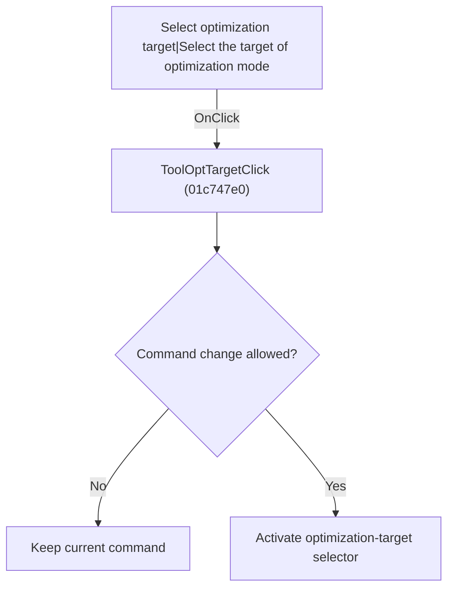

# Select optimization target|Select the target of optimization mode

> Analysis status: Individually reviewed.

## Control

| Property | Recovered value |
| --- | --- |
| Form | SchematicEditor |
| Component path | SchematicEditor.TopToolBar.EditorTools.ToolOptTarget |
| Control class | TSpeedButton |
| Caption | Not present in the recovered resource. |
| Hint | Select optimization target\|Select the target of optimization mode |
| Text | Not present in the recovered resource. |
| Handler name | ToolOptTargetClick |
| Handler address | 01c747e0 |
| Graph node | `resource:dfm:SchematicEditor/SchematicEditor.TopToolBar.EditorTools.ToolOptTarget` |
| Handler node | `function:01c747e0` |
| Graph layer | UI |

## What happens when clicked

If the command can be changed, the handler constructs an optimization-target selection command, replaces the current command, and activates its toolbar button.

## Click flow

## Handler evidence

- Source: [DecompiledSources/Tina16/functions/0000000001C747E0__FUN_01c747e0.c](../../../DecompiledSources/Tina16/functions/0000000001C747E0__FUN_01c747e0.c)
- Recovered role: Activate optimization-target selection.
- Current graph summary: Handles 1 Delphi UI event: SchematicEditor.TopToolBar.EditorTools.ToolOptTarget.OnClick.
- Current graph behavior: If the command can be changed, the handler constructs an optimization-target selection command, replaces the current command, and activates its toolbar button.
- Current graph evidence: The recovered body uses the common command guard, constructs one distinct selector class, passes it to FUN_01c6cee0, and activates ToolOptTarget. The paired Select Optimization Target menu delegates to this control.
- Complexity: complex
- Distinct outgoing calls: 3

## Direct calls

- `function:01364e80` — FUN_01364e80
- `function:01c6cee0` — FUN_01c6cee0
- `function:01c6d670` — FUN_01c6d670

## Resource evidence

- Kind: Not present in the recovered resource.
- Modal result: Not present in the recovered resource.
- Checked state: Not present in the recovered resource.
- List items: Not present in the recovered resource.
- Image reference: Not present in the recovered resource.
- Extracted glyph: [`0332_SchematicEditor_SchematicEditor_TopToolBar_EditorTools_ToolOptTarget_Glyph_Data.png`](../../../glyph/0332_SchematicEditor_SchematicEditor_TopToolBar_EditorTools_ToolOptTarget_Glyph_Data.png)

## Nearby label candidates

Nearby labels are layout candidates only. They are not proof of behavior.

- No same-parent label candidate is available.

## Analysis limits

- The selector class name is not present in the recovered symbols.

