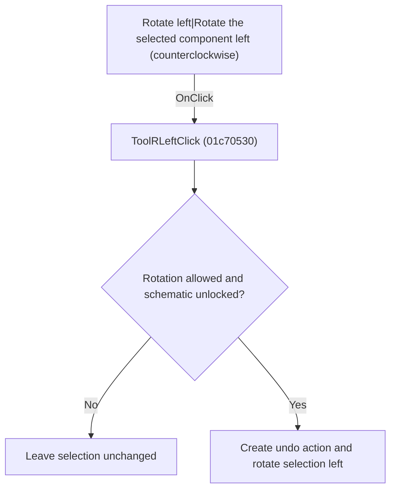

# Rotate left|Rotate the selected component left (counterclockwise)

> Analysis status: Individually reviewed.

## Control

| Property | Recovered value |
| --- | --- |
| Form | SchematicEditor |
| Component path | SchematicEditor.TopToolBar.EditorTools.ToolRLeft |
| Control class | TSpeedButton |
| Caption | Not present in the recovered resource. |
| Hint | Rotate left\|Rotate the selected component left (counterclockwise) |
| Text | Not present in the recovered resource. |
| Handler name | ToolRLeftClick |
| Handler address | 01c70530 |
| Graph node | `resource:dfm:SchematicEditor/SchematicEditor.TopToolBar.EditorTools.ToolRLeft` |
| Handler node | `function:01c70530` |
| Graph layer | UI |

## What happens when clicked

The handler delegates to the rotate-left operation. That operation checks command and lock state, creates an undo action, rotates the selected schematic objects, redraws when required, and records the operation result. Sender is not read, so all three bound controls behave identically.

## Click flow

## Handler evidence

- Source: [DecompiledSources/Tina16/functions/0000000001C70530__FUN_01c70530.c](../../../DecompiledSources/Tina16/functions/0000000001C70530__FUN_01c70530.c)
- Recovered role: Rotate selected schematic objects left.
- Current graph summary: Handles 3 Delphi UI events: SchematicEditor.SpeedButton7.OnClick, SchematicEditor.SpeedButton8.OnClick, SchematicEditor.TopToolBar.EditorTools.ToolRLeft.OnClick.
- Current graph behavior: The handler delegates to the rotate-left operation. That operation checks command and lock state, creates an undo action, rotates the selected schematic objects, redraws when required, and records the operation result. Sender is not read, so all three bound controls behave identically.
- Current graph evidence: FUN_01c70530 only calls FUN_01c6d1a0. The recovered callee contains the permission and lock guards, undo creation, selected-object transform, conditional redraw, and result flag update. The handler has three DFM OnClick bindings.
- Complexity: simple
- Distinct outgoing calls: 1

## Direct calls

- `function:01c6d1a0` — FUN_01c6d1a0

## Resource evidence

- Kind: Not present in the recovered resource.
- Modal result: Not present in the recovered resource.
- Checked state: Not present in the recovered resource.
- List items: Not present in the recovered resource.
- Image reference: Not present in the recovered resource.
- Extracted glyph: [`0338_SchematicEditor_SchematicEditor_TopToolBar_EditorTools_ToolRLeft_Glyph_Data.png`](../../../glyph/0338_SchematicEditor_SchematicEditor_TopToolBar_EditorTools_ToolRLeft_Glyph_Data.png)

## Nearby label candidates

Nearby labels are layout candidates only. They are not proof of behavior.

- No same-parent label candidate is available.

## Analysis limits

- Two bound speed buttons have no recovered caption; their shared handler proves the same rotate-left path.

