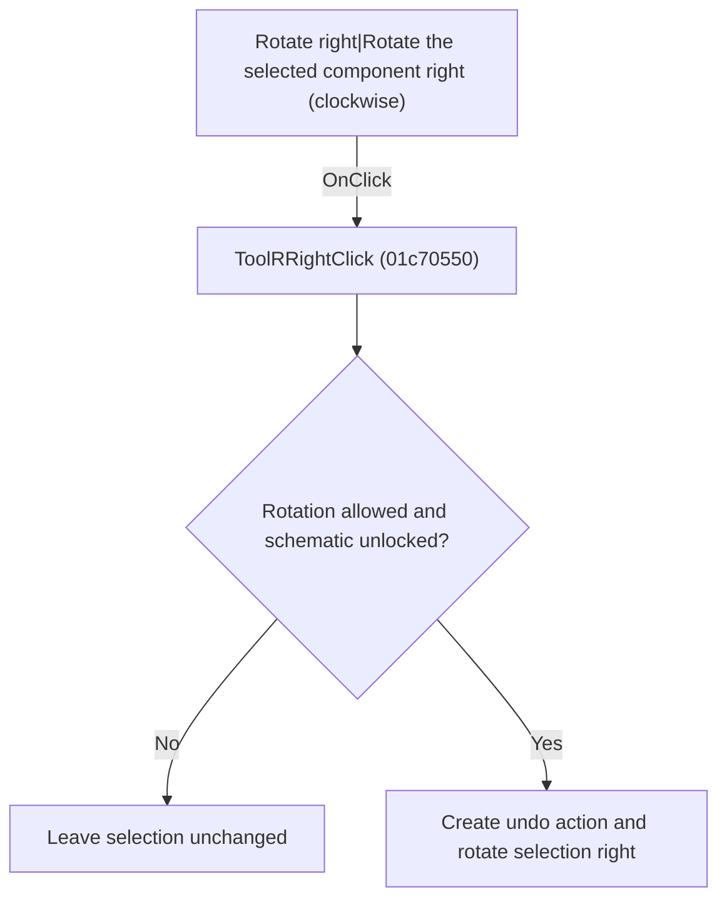

# Rotate right|Rotate the selected component right (clockwise)

> Analysis status: Individually reviewed.

## Control

| Property | Recovered value |
| --- | --- |
| Form | SchematicEditor |
| Component path | SchematicEditor.TopToolBar.EditorTools.ToolRRight |
| Control class | TSpeedButton |
| Caption | Not present in the recovered resource. |
| Hint | Rotate right\|Rotate the selected component right (clockwise) |
| Text | Not present in the recovered resource. |
| Handler name | ToolRRightClick |
| Handler address | 01c70550 |
| Graph node | `resource:dfm:SchematicEditor/SchematicEditor.TopToolBar.EditorTools.ToolRRight` |
| Handler node | `function:01c70550` |
| Graph layer | UI |

## What happens when clicked

The handler delegates to the rotate-right operation. That operation checks command and lock state, creates an undo action, rotates selected objects, redraws when required, and records the operation result.

## Click flow

## Handler evidence

- Source: [DecompiledSources/Tina16/functions/0000000001C70550__FUN_01c70550.c](../../../DecompiledSources/Tina16/functions/0000000001C70550__FUN_01c70550.c)
- Recovered role: Rotate selected schematic objects right.
- Current graph summary: Handles 1 Delphi UI event: SchematicEditor.TopToolBar.EditorTools.ToolRRight.OnClick.
- Current graph behavior: The handler delegates to the rotate-right operation. That operation checks command and lock state, creates an undo action, rotates selected objects, redraws when required, and records the operation result.
- Current graph evidence: FUN_01c70550 only calls FUN_01c6d2f0. The recovered callee contains the guard, undo, selected-object transform, redraw, and result paths.
- Complexity: simple
- Distinct outgoing calls: 1

## Direct calls

- `function:01c6d2f0` — FUN_01c6d2f0

## Resource evidence

- Kind: Not present in the recovered resource.
- Modal result: Not present in the recovered resource.
- Checked state: Not present in the recovered resource.
- List items: Not present in the recovered resource.
- Image reference: Not present in the recovered resource.
- Extracted glyph: [`0337_SchematicEditor_SchematicEditor_TopToolBar_EditorTools_ToolRRight_Glyph_Data.png`](../../../glyph/0337_SchematicEditor_SchematicEditor_TopToolBar_EditorTools_ToolRRight_Glyph_Data.png)

## Nearby label candidates

Nearby labels are layout candidates only. They are not proof of behavior.

- No same-parent label candidate is available.

## Analysis limits

- The transform geometry is expressed through recovered helper calls rather than named Delphi methods.

