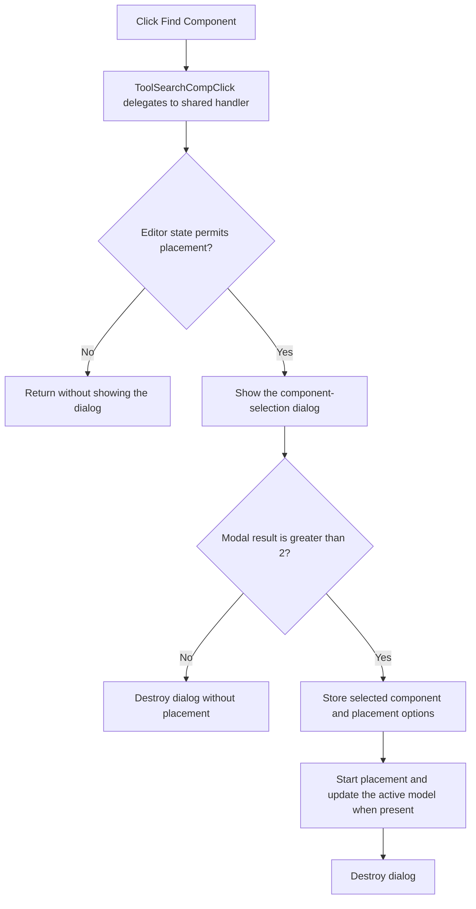

# Find Component

> Analysis status: Complete.

## Control

| Property | Recovered value |
| --- | --- |
| Form | SchematicEditor |
| Component path | SchematicEditor.TopToolBar.CompDropDownP.ToolSearchComp |
| Control class | TSpeedButton |
| Hint | Find Component |
| Handler | `ToolSearchCompClick` at `01c97ce0` |
| Graph nodes | `resource:dfm:SchematicEditor/SchematicEditor.TopToolBar.CompDropDownP.ToolSearchComp` → `function:01c97ce0` |
| Graph layer | UI |

## What happens when clicked

The toolbar handler delegates to `FUN_01c979b0`, the same handler used by the Main Menu `FindComponent` item. That shared path first checks `FUN_01c8cee0`. If the current editor or document state blocks the command, it returns without showing the dialog.

When permitted, it creates the component-selection dialog and runs it modally. Results `0` through `2` cause no placement. A result greater than `2` stores the selected command mode, component name, library record, and placement options in Schematic Editor fields. It then starts the appropriate placement command. When the auxiliary editor model at `+0x1898` exists, the handler also builds the selected component record, updates the model, and redraws it. The dialog is destroyed on every normal exit.

The handler does not report a message for cancel or a blocked command. It has no local exception handler.

## Click flow

## Evidence

- Toolbar handler: [FUN_01c97ce0](../../../DecompiledSources/Tina16/functions/0000000001C97CE0__FUN_01c97ce0.c)
- Shared Find Component path: [FUN_01c979b0](../../../DecompiledSources/Tina16/functions/0000000001C979B0__FUN_01c979b0.c)
- Command gate: [FUN_01c8cee0](../../../DecompiledSources/Tina16/functions/0000000001C8CEE0__FUN_01c8cee0.c)
- Extracted glyph: [Find Component glyph](../../../glyph/0330_SchematicEditor_SchematicEditor_TopToolBar_CompDropDownP_ToolSearchComp_Glyph_Data.png)
- Recovered role: Open component selection and start the selected placement command.

## Analysis limits

- Numeric modal results above `2` and several stored option fields do not have recovered Delphi enumeration names.
