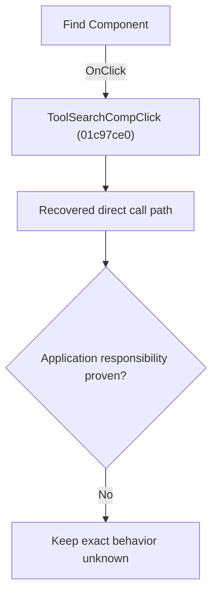

# Find Component

> Analysis status: Blocked by an exact evidence gap.

## Control

| Property | Recovered value |
| --- | --- |
| Form | SchematicEditor |
| Component path | SchematicEditor.TopToolBar.CompDropDownP.ToolSearchComp |
| Control class | TSpeedButton |
| Caption | Not present in the recovered resource. |
| Hint | Find Component |
| Text | Not present in the recovered resource. |
| Handler name | ToolSearchCompClick |
| Handler address | 01c97ce0 |
| Graph node | `resource:dfm:SchematicEditor/SchematicEditor.TopToolBar.CompDropDownP.ToolSearchComp` |
| Handler node | `function:01c97ce0` |
| Graph layer | UI |

## What happens when clicked

The OnClick binding reaches ToolSearchCompClick at 01c97ce0. The recovered body has 1 distinct outgoing graph call(s), but the application-specific responsibilities and data effects of its downstream path are not established in the accepted graph evidence. The control's caption or name indicates user intent only; it is not enough to claim implementation behavior.

## Click flow

## Handler evidence

- Source: [DecompiledSources/Tina16/functions/0000000001C97CE0__FUN_01c97ce0.c](../../../DecompiledSources/Tina16/functions/0000000001C97CE0__FUN_01c97ce0.c)
- Recovered role: Evidence-blocked ToolSearchCompClick command.
- Current graph summary: Handles 1 Delphi UI event: SchematicEditor.TopToolBar.CompDropDownP.ToolSearchComp.OnClick.
- Current graph behavior: The OnClick binding reaches ToolSearchCompClick at 01c97ce0. The recovered body has 1 distinct outgoing graph call(s), but the application-specific responsibilities and data effects of its downstream path are not established in the accepted graph evidence. The control's caption or name indicates user intent only; it is not enough to claim implementation behavior.
- Current graph evidence: The DFM binds SchematicEditor.TopToolBar.CompDropDownP.ToolSearchComp to ToolSearchCompClick. The recovered source is DecompiledSources/Tina16/functions/0000000001C97CE0__FUN_01c97ce0.c and directly references 01c979b0. No accepted end-to-end role was established for this control path.
- Complexity: simple
- Distinct outgoing calls: 1

## Direct calls

- `function:01c979b0` — Handles 1 Delphi UI event: SchematicEditor.MainMenu.mnTools.FindComponent.OnClick.

## Resource evidence

- Kind: Not present in the recovered resource.
- Modal result: Not present in the recovered resource.
- Checked state: Not present in the recovered resource.
- List items: Not present in the recovered resource.
- Image reference: Not present in the recovered resource.
- Extracted glyph: [`0330_SchematicEditor_SchematicEditor_TopToolBar_CompDropDownP_ToolSearchComp_Glyph_Data.png`](../../../glyph/0330_SchematicEditor_SchematicEditor_TopToolBar_CompDropDownP_ToolSearchComp_Glyph_Data.png)

## Nearby label candidates

Nearby labels are layout candidates only. They are not proof of behavior.

- No same-parent label candidate is available.

## Analysis limits

- Exact gap: the recovered handler or one of its direct application callees lacks a source-supported role that proves the command's decisions, state changes, and output. Keep this Bead open until those callees are traced.

