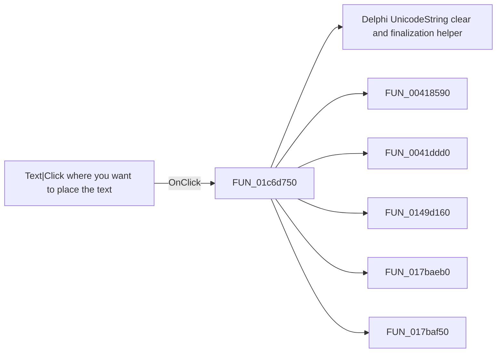

# Text|Click where you want to place the text

> Analysis status: Pending individual source review.

## Control

| Property | Recovered value |
| --- | --- |
| Form | SchematicEditor |
| Component path | SchematicEditor.TopToolBar.EditorTools.ToolText |
| Control class | TSpeedButton |
| Caption | Not present in the recovered resource. |
| Hint | Text\|Click where you want to place the text |
| Text | Not present in the recovered resource. |
| Handler name | ToolTextClick |
| Handler address | 01c6d750 |
| Graph node | `resource:dfm:SchematicEditor/SchematicEditor.TopToolBar.EditorTools.ToolText` |
| Handler node | `function:01c6d750` |
| Graph layer | UI |

## What happens when clicked

Pending individual analysis. An agent must read the recovered handler source and its relevant callees before it replaces this text.

## Click flow

## Handler evidence

- Source: [DecompiledSources/Tina16/functions/0000000001C6D750__FUN_01c6d750.c](../../../DecompiledSources/Tina16/functions/0000000001C6D750__FUN_01c6d750.c)
- Recovered role: Not present in the recovered resource.
- Current graph summary: Handles 1 Delphi UI event: SchematicEditor.TopToolBar.EditorTools.ToolText.OnClick.
- Current graph behavior: Not present in the recovered resource.
- Current graph evidence: Not present in the recovered resource.
- Complexity: complex
- Distinct outgoing calls: 13

## Direct calls

- `function:00414480` — Delphi UnicodeString clear and finalization helper
- `function:00418590` — FUN_00418590
- `function:0041ddd0` — FUN_0041ddd0
- `function:0149d160` — FUN_0149d160
- `function:017baeb0` — FUN_017baeb0
- `function:017baf50` — FUN_017baf50
- `function:0198d430` — FUN_0198d430
- `function:01993f30` — FUN_01993f30
- `function:01994230` — FUN_01994230
- `function:01a9a4e0` — FUN_01a9a4e0
- `function:01c6cf20` — FUN_01c6cf20
- `function:01c6d670` — FUN_01c6d670
- `function:01c8cee0` — FUN_01c8cee0

## Resource evidence

- Kind: Not present in the recovered resource.
- Modal result: Not present in the recovered resource.
- Checked state: Not present in the recovered resource.
- List items: Not present in the recovered resource.
- Image reference: Not present in the recovered resource.
- Extracted glyph: [`0340_SchematicEditor_SchematicEditor_TopToolBar_EditorTools_ToolText_Glyph_Data.png`](../../../glyph/0340_SchematicEditor_SchematicEditor_TopToolBar_EditorTools_ToolText_Glyph_Data.png)

## Nearby label candidates

Nearby labels are layout candidates only. They are not proof of behavior.

- No same-parent label candidate is available.

## Analysis limits

- Do not infer behavior from the control class, caption, hint, glyph, or nearby label alone.
- Do not replace the pending status until the handler source and relevant call path provide enough evidence.
