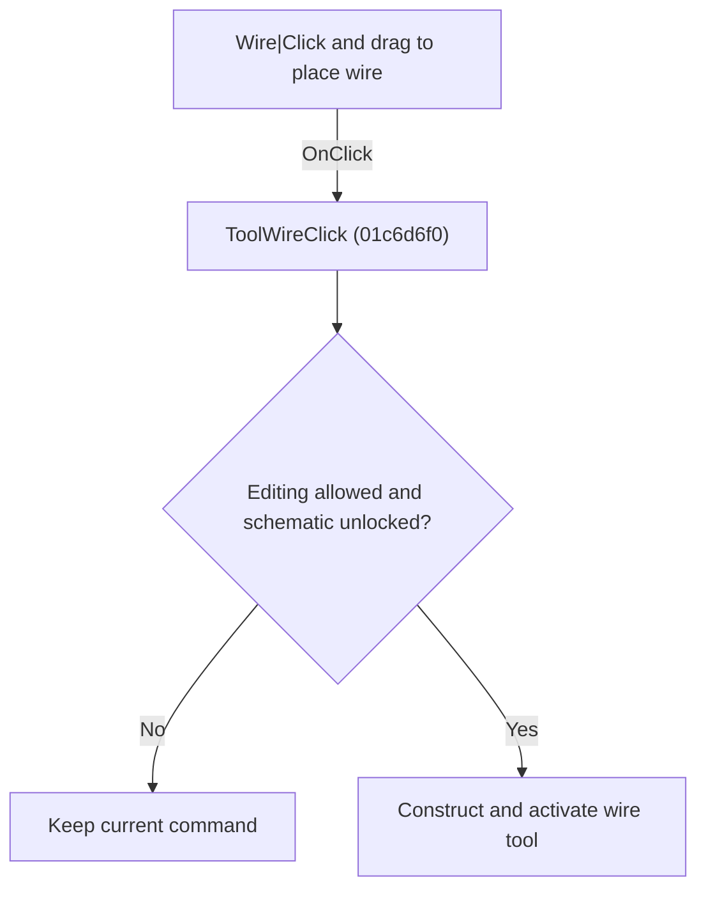

# Wire|Click and drag to place wire

> Analysis status: Individually reviewed.

## Control

| Property | Recovered value |
| --- | --- |
| Form | SchematicEditor |
| Component path | SchematicEditor.TopToolBar.EditorTools.ToolWire |
| Control class | TSpeedButton |
| Caption | Not present in the recovered resource. |
| Hint | Wire\|Click and drag to place wire |
| Text | Not present in the recovered resource. |
| Handler name | ToolWireClick |
| Handler address | 01c6d6f0 |
| Graph node | `resource:dfm:SchematicEditor/SchematicEditor.TopToolBar.EditorTools.ToolWire` |
| Handler node | `function:01c6d6f0` |
| Graph layer | UI |

## What happens when clicked

If editing is allowed and the schematic is not locked, the handler constructs a wire-placement command, replaces the current command, and activates the wire tool button. If the guard fails, it makes no change.

## Click flow

## Handler evidence

- Source: [DecompiledSources/Tina16/functions/0000000001C6D6F0__FUN_01c6d6f0.c](../../../DecompiledSources/Tina16/functions/0000000001C6D6F0__FUN_01c6d6f0.c)
- Recovered role: Activate the wire placement tool.
- Current graph summary: Handles 1 Delphi UI event: SchematicEditor.TopToolBar.EditorTools.ToolWire.OnClick.
- Current graph behavior: If editing is allowed and the schematic is not locked, the handler constructs a wire-placement command, replaces the current command, and activates the wire tool button. If the guard fails, it makes no change.
- Current graph evidence: The body checks the common permission and lock conditions, constructs a command with the recovered wire-tool VMT, passes it to FUN_01c6cee0, and activates the toolbar control through FUN_01c6d670.
- Complexity: complex
- Distinct outgoing calls: 4

## Direct calls

- `function:01367900` — FUN_01367900
- `function:01c6cee0` — FUN_01c6cee0
- `function:01c6d670` — FUN_01c6d670
- `function:01c8cee0` — FUN_01c8cee0

## Resource evidence

- Kind: Not present in the recovered resource.
- Modal result: Not present in the recovered resource.
- Checked state: Not present in the recovered resource.
- List items: Not present in the recovered resource.
- Image reference: Not present in the recovered resource.
- Extracted glyph: [`0341_SchematicEditor_SchematicEditor_TopToolBar_EditorTools_ToolWire_Glyph_Data.png`](../../../glyph/0341_SchematicEditor_SchematicEditor_TopToolBar_EditorTools_ToolWire_Glyph_Data.png)

## Nearby label candidates

Nearby labels are layout candidates only. They are not proof of behavior.

- No same-parent label candidate is available.

## Analysis limits

- The recovered command class has no Delphi class name.

