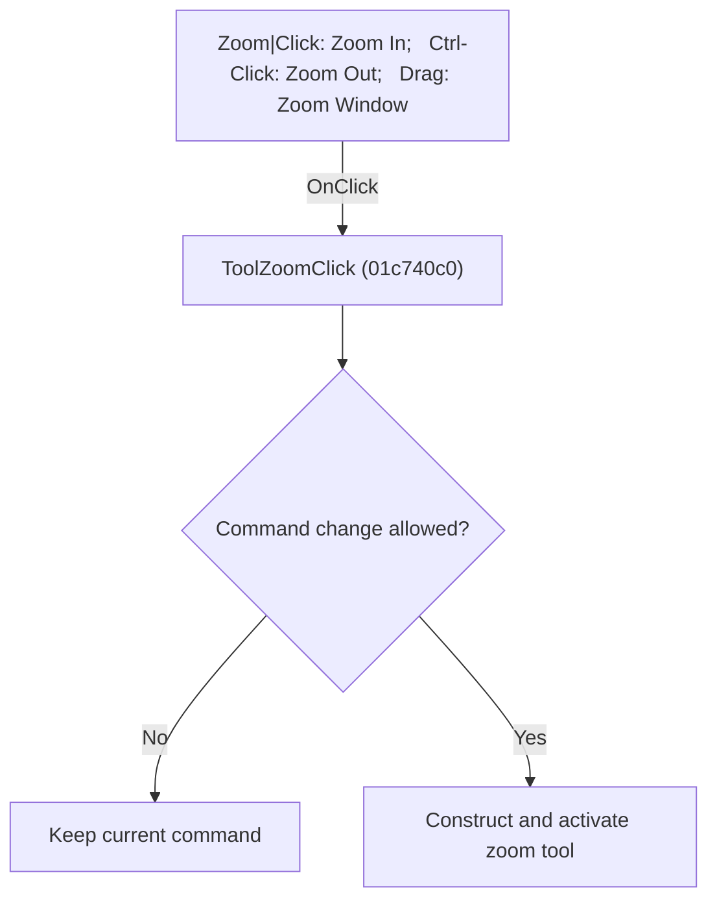

# Zoom|Click: Zoom In;   Ctrl-Click: Zoom Out;   Drag: Zoom Window

> Analysis status: Individually reviewed.

## Control

| Property | Recovered value |
| --- | --- |
| Form | SchematicEditor |
| Component path | SchematicEditor.TopToolBar.EditorTools.ToolZoom |
| Control class | TSpeedButton |
| Caption | Not present in the recovered resource. |
| Hint | Zoom\|Click: Zoom In;   Ctrl-Click: Zoom Out;   Drag: Zoom Window |
| Text | Not present in the recovered resource. |
| Handler name | ToolZoomClick |
| Handler address | 01c740c0 |
| Graph node | `resource:dfm:SchematicEditor/SchematicEditor.TopToolBar.EditorTools.ToolZoom` |
| Handler node | `function:01c740c0` |
| Graph layer | UI |

## What happens when clicked

If the command can be changed, the handler constructs the interactive zoom command, replaces the current command, and activates its toolbar button.

## Click flow

## Handler evidence

- Source: [DecompiledSources/Tina16/functions/0000000001C740C0__FUN_01c740c0.c](../../../DecompiledSources/Tina16/functions/0000000001C740C0__FUN_01c740c0.c)
- Recovered role: Activate the interactive zoom tool.
- Current graph summary: Handles 1 Delphi UI event: SchematicEditor.TopToolBar.EditorTools.ToolZoom.OnClick.
- Current graph behavior: If the command can be changed, the handler constructs the interactive zoom command, replaces the current command, and activates its toolbar button.
- Current graph evidence: The recovered body uses the shared command guard, constructs a distinct tool class, sends it to FUN_01c6cee0, and activates ToolZoom through FUN_01c6d670.
- Complexity: complex
- Distinct outgoing calls: 3

## Direct calls

- `function:01369f00` — FUN_01369f00
- `function:01c6cee0` — FUN_01c6cee0
- `function:01c6d670` — FUN_01c6d670

## Resource evidence

- Kind: Not present in the recovered resource.
- Modal result: Not present in the recovered resource.
- Checked state: Not present in the recovered resource.
- List items: Not present in the recovered resource.
- Image reference: Not present in the recovered resource.
- Extracted glyph: [`0334_SchematicEditor_SchematicEditor_TopToolBar_EditorTools_ToolZoom_Glyph_Data.png`](../../../glyph/0334_SchematicEditor_SchematicEditor_TopToolBar_EditorTools_ToolZoom_Glyph_Data.png)

## Nearby label candidates

Nearby labels are layout candidates only. They are not proof of behavior.

- No same-parent label candidate is available.

## Analysis limits

- The tool class is recovered without a Delphi class name.

