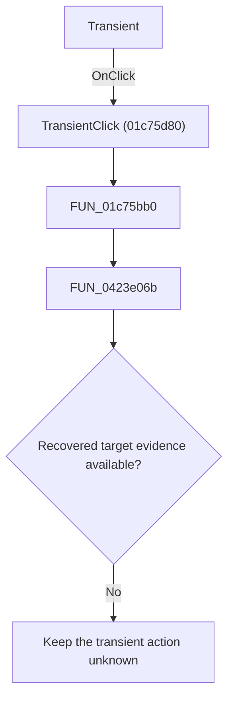

# Transient

> Analysis status: Blocked by an exact evidence gap.

## Control

| Property | Recovered value |
| --- | --- |
| Form | SchematicEditor |
| Component path | SchematicEditor.MainMenu.mnAnalysis.Transient |
| Control class | TMenuItem |
| Caption | &Transient... |
| Handler name | TransientClick |
| Handler address | 01c75d80 |
| Graph node | `resource:dfm:SchematicEditor/SchematicEditor.MainMenu.mnAnalysis.Transient` |
| Handler node | `function:01c75d80` |
| Graph layer | UI |

## What happens when clicked

The click reaches `TransientClick` at 01c75d80. That handler calls `FUN_01c75bb0` with a recovered zero mode value. The recovered wrapper ignores its visible parameters and calls `FUN_0423e06b`. No recovered source, graph node, call edges, or accepted annotation identifies `FUN_0423e06b`, so the application effect is not proven.

## Click flow

## Handler evidence

- Source: [DecompiledSources/Tina16/functions/0000000001C75D80__FUN_01c75d80.c](../../../DecompiledSources/Tina16/functions/0000000001C75D80__FUN_01c75d80.c)
- Wrapper source: [DecompiledSources/Tina16/functions/0000000001C75BB0__FUN_01c75bb0.c](../../../DecompiledSources/Tina16/functions/0000000001C75BB0__FUN_01c75bb0.c)
- The DFM caption indicates a Transient command, but the caption alone does not prove the implementation.
- No extracted glyph is associated with this control.

## Analysis limits

- Exact gap: recover or identify `FUN_0423e06b` and its application-relevant path. The current function graph has no node, source body, edges, or annotation for that target.
- No annotation fragment is created for this bead.
