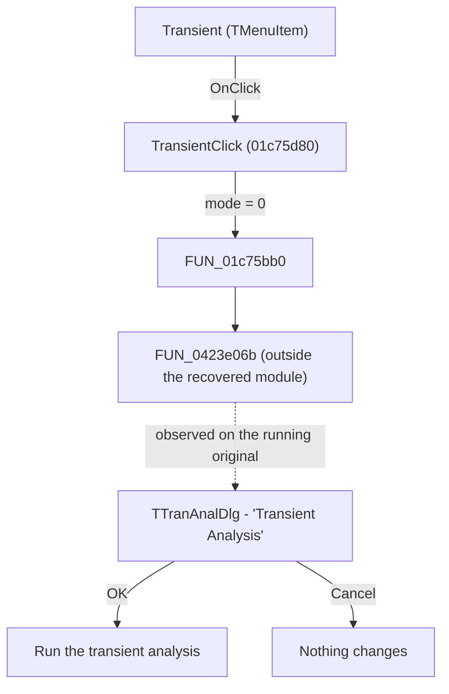

# Transient

> Analysis status: Behaviour observed on the running original; the static path ends in protected code.

## Control

| Property | Recovered value |
| --- | --- |
| Form | SchematicEditor |
| Component path | SchematicEditor.MainMenu.mnAnalysis.Transient |
| Control class | TMenuItem |
| Caption | &Transient... |
| Handler name | TransientClick |
| Handler address | 01c75d80 |
| Graph node | `resource:dfm:SchematicEditor/SchematicEditor.MainMenu.mnAnalysis.Transient` |
| Handler node | `function:01c75d80` |
| Graph layer | UI |

## What happens when clicked

Choosing `Analysis > Transient...` opens the Transient Analysis dialog, a modal
window of class `TTranAnalDlg` captioned `Transient Analysis`. The dialog asks
for the two times that bound the run, what the run starts from, and whether to
draw the excitation; it is dismissed with OK, Cancel or Help, and the schematic
is not touched until it is accepted.

This was established by running the original and choosing the command, not by
reading the handler: the static path does not reach that far, for the reason
below.

## Click flow

## Why the static path stops

`TransientClick` calls `FUN_01c75bb0` with a mode value of zero, and that
wrapper calls `FUN_0423e06b` and returns. `FUN_0423e06b` has no recovered body,
no graph node and no call edges - and it cannot have any. The recovered module
runs from 00406de0 to 01d87790; 0423e06b lies well beyond its end, in the
region the protector owns. 89,226 functions were recovered from the module and
none sits at that address.

So the call is real and its target is real, but the target is code the
protector holds and Ghidra never saw. No amount of further static work on this
image will name it. What it does is therefore established the only way left:
by watching the running program.

## Inputs

- The schematic on the sheet, which the dialog's defaults are drawn from: on a
  new empty sheet the original offers a start of `0` and an end of `1u`.
- The mode value the handler passes, which is zero for this menu item. The same
  wrapper is reached with other values from other commands, so the zero is what
  distinguishes the transient run.

## Decisions

- The dialog decides nothing by itself. Which of the three starting points
  applies - calculate the operating point, use initial conditions, or zero
  initial values - is the user's choice, and the original opens on the first.

## State changes

- None until the dialog is accepted. Opening and cancelling it leaves the
  document unmodified, which is what the original shows: the title keeps its
  name and the sheet is untouched.

## Outputs

- On OK, a transient analysis over the times given.
- With an empty sheet the original does not reach the dialog's own work at all:
  it raises the Electric Rules Check window and an error, since there is
  nothing to analyse.

## Errors and no-op behaviour

- Cancel and the window's close button are a no-op.
- Help opens the help topic for the dialog.
- With no components on the sheet, the command answers with the Electric Rules
  Check window and an error message rather than with the dialog.

## Handler evidence

- Source: [DecompiledSources/Tina16/functions/0000000001C75D80__FUN_01c75d80.c](../../../DecompiledSources/Tina16/functions/0000000001C75D80__FUN_01c75d80.c)
- Wrapper source: [DecompiledSources/Tina16/functions/0000000001C75BB0__FUN_01c75bb0.c](../../../DecompiledSources/Tina16/functions/0000000001C75BB0__FUN_01c75bb0.c)
- Dialog resource: `TranAnalDlg`, 15 components, captioned `Transient Analysis`.
- Observed window: `TTranAnalDlg`, captioned `Transient Analysis`, seen by
  choosing the command on the running original and recording the window that
  appeared.
- Picture of the dialog: [screenshots/Transient_Analysis.png](../../../screenshots/Transient_Analysis.png)
- The DFM caption indicates a Transient command; the observation above is what
  proves it, not the caption.
- No extracted glyph is associated with this control.

## Analysis limits

- What `FUN_0423e06b` does internally stays unknown, and will stay unknown from
  this image: it is in the protector's region, not the recovered module. The
  observation settles what the command does, not how that code does it.
- The defaults the dialog opens with were read on a new empty sheet. A sheet
  carrying a circuit may open the dialog on values taken from it.
