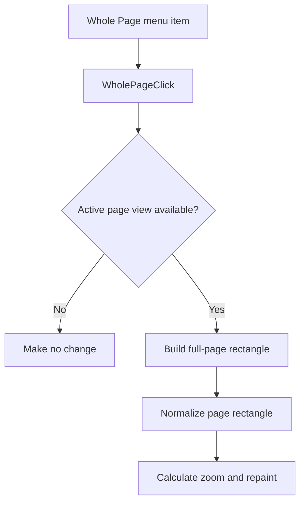

# Whole &Page

> Analysis status: Reviewed with recovered zoom-rectangle evidence.

## Control

| Property | Recovered value |
| --- | --- |
| Component path | `SchematicEditor.MainMenu.View.Zoom.WholePage` |
| Control class | `TMenuItem` |
| Handler | `WholePageClick` at `01c83f50` |

## What happens when clicked

The command runs only when an active schematic and its page view are available. It builds a rectangle from the recovered page origin, width, and height. The common zoom helper normalizes the rectangle, transforms it for the active view, calculates the zoom, and repaints the editor. This makes the whole page fit the available view.

## Click flow

## Evidence

- [Handler source](../../../DecompiledSources/Tina16/functions/0000000001C83F50__FUN_01c83f50.c) supplies the page origin, width, and height to the common zoom helper.
- [Zoom helper](../../../DecompiledSources/Tina16/functions/0000000001C750D0__FUN_01c750d0.c) normalizes, transforms, fits, and repaints the supplied rectangle.

## Analysis limits

- The recovered code does not expose the final numeric zoom percentage.
