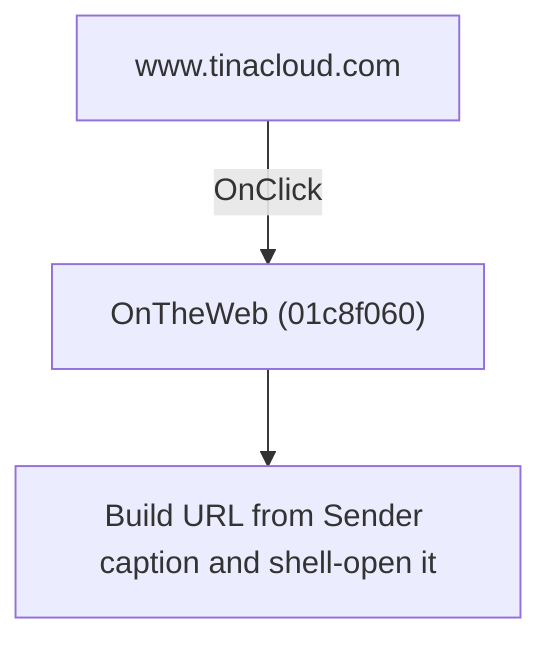

# www.tinacloud.com

> Analysis status: Individually reviewed.

## Control

| Property | Recovered value |
| --- | --- |
| Form | SchematicEditor |
| Component path | SchematicEditor.MainMenu.Help.mnDesignSoftontheWeb.wwwtinacloudcom |
| Control class | TMenuItem |
| Caption | www.tinacloud.com |
| Hint | Not present in the recovered resource. |
| Text | Not present in the recovered resource. |
| Handler name | OnTheWeb |
| Handler address | 01c8f060 |
| Graph node | `resource:dfm:SchematicEditor/SchematicEditor.MainMenu.Help.mnDesignSoftontheWeb.wwwtinacloudcom` |
| Handler node | `function:01c8f060` |
| Graph layer | UI |

## What happens when clicked

The handler reads the clicked menu caption, prefixes it with http://, and asks the Windows shell to open the resulting address. Each of the six controls therefore opens the website shown in its own caption.

## Click flow

## Handler evidence

- Source: [DecompiledSources/Tina16/functions/0000000001C8F060__FUN_01c8f060.c](../../../DecompiledSources/Tina16/functions/0000000001C8F060__FUN_01c8f060.c)
- Recovered role: Open the clicked vendor web address.
- Current graph summary: Handles 6 Delphi UI events: SchematicEditor.MainMenu.Help.mnDesignSoftontheWeb.wwwdesignsoftwarecom.OnClick, SchematicEditor.MainMenu.Help.mnDesignSoftontheWeb.wwwtinacom.OnClick, SchematicEditor.MainMenu.Help.mnDesignSoftontheWeb.wwwtinacloudcom.OnClick.
- Current graph behavior: The handler reads the clicked menu caption, prefixes it with http://, and asks the Windows shell to open the resulting address. Each of the six controls therefore opens the website shown in its own caption.
- Current graph evidence: The recovered body reads the Sender caption property, concatenates the literal http://, and invokes ShellExecute with the literal open. Six captioned DFM menu items share the address.
- Complexity: complex
- Distinct outgoing calls: 5

## Direct calls

- `function:004113f0` — FUN_004113f0
- `function:00414480` — Delphi UnicodeString clear and finalization helper
- `function:00416740` — FUN_00416740
- `function:00416cd0` — FUN_00416cd0
- `function:01c8eff0` — FUN_01c8eff0

## Resource evidence

- Kind: Not present in the recovered resource.
- Modal result: Not present in the recovered resource.
- Checked state: Not present in the recovered resource.
- List items: Not present in the recovered resource.
- Image reference: Not present in the recovered resource.
- Extracted glyph: None.

## Nearby label candidates

Nearby labels are layout candidates only. They are not proof of behavior.

- No same-parent label candidate is available.

## Analysis limits

- The handler does not validate availability or force HTTPS.

