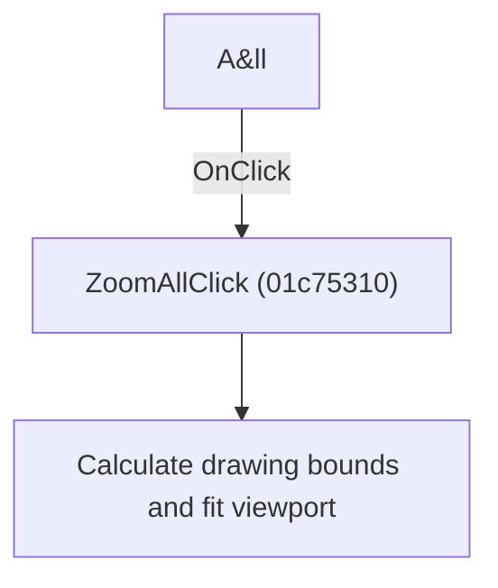

# A&ll

> Analysis status: Individually reviewed.

## Control

| Property | Recovered value |
| --- | --- |
| Form | SchematicEditor |
| Component path | SchematicEditor.MainMenu.View.Zoom.ZoomAll |
| Control class | TMenuItem |
| Caption | A&ll |
| Hint | Not present in the recovered resource. |
| Text | Not present in the recovered resource. |
| Handler name | ZoomAllClick |
| Handler address | 01c75310 |
| Graph node | `resource:dfm:SchematicEditor/SchematicEditor.MainMenu.View.Zoom.ZoomAll` |
| Handler node | `function:01c75310` |
| Graph layer | UI |

## What happens when clicked

The handler calculates the full drawing bounds with the active display settings and applies a viewport that fits those bounds.

## Click flow

## Handler evidence

- Source: [DecompiledSources/Tina16/functions/0000000001C75310__FUN_01c75310.c](../../../DecompiledSources/Tina16/functions/0000000001C75310__FUN_01c75310.c)
- Recovered role: Fit the complete schematic drawing.
- Current graph summary: Handles 1 Delphi UI event: SchematicEditor.MainMenu.View.Zoom.ZoomAll.OnClick.
- Current graph behavior: The handler calculates the full drawing bounds with the active display settings and applies a viewport that fits those bounds.
- Current graph evidence: The recovered body calls the drawing-bounds helper with the document and display-state fields, then passes the returned rectangle to the viewport-fit helper. The menu caption is All.
- Complexity: moderate
- Distinct outgoing calls: 2

## Direct calls

- `function:0198d580` — FUN_0198d580
- `function:01c750d0` — FUN_01c750d0

## Resource evidence

- Kind: Not present in the recovered resource.
- Modal result: Not present in the recovered resource.
- Checked state: Not present in the recovered resource.
- List items: Not present in the recovered resource.
- Image reference: Not present in the recovered resource.
- Extracted glyph: None.

## Nearby label candidates

Nearby labels are layout candidates only. They are not proof of behavior.

- No same-parent label candidate is available.

## Analysis limits

- The bounds and viewport helpers have recovered addresses but no Delphi names.

