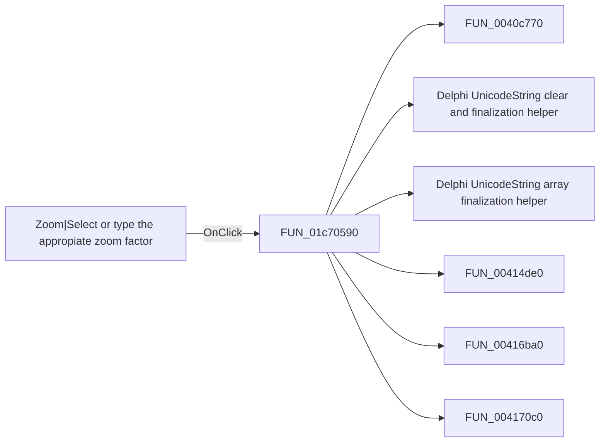

# Zoom|Select or type the appropiate zoom factor

> Analysis status: Pending individual source review.

## Control

| Property | Recovered value |
| --- | --- |
| Form | SchematicEditor |
| Component path | SchematicEditor.TopToolBar.EditorTools.ZoomFactor |
| Control class | TComboBox |
| Caption | Not present in the recovered resource. |
| Hint | Zoom\|Select or type the appropiate zoom factor |
| Text | 100% |
| Handler name | ZoomFactorClick |
| Handler address | 01c70590 |
| Graph node | `resource:dfm:SchematicEditor/SchematicEditor.TopToolBar.EditorTools.ZoomFactor` |
| Handler node | `function:01c70590` |
| Graph layer | UI |

## What happens when clicked

Pending individual analysis. An agent must read the recovered handler source and its relevant callees before it replaces this text.

## Click flow

## Handler evidence

- Source: [DecompiledSources/Tina16/functions/0000000001C70590__FUN_01c70590.c](../../../DecompiledSources/Tina16/functions/0000000001C70590__FUN_01c70590.c)
- Recovered role: Not present in the recovered resource.
- Current graph summary: Handles 1 Delphi UI event: SchematicEditor.TopToolBar.EditorTools.ZoomFactor.OnClick.
- Current graph behavior: Not present in the recovered resource.
- Current graph evidence: Not present in the recovered resource.
- Complexity: complex
- Distinct outgoing calls: 15

## Direct calls

- `function:0040c770` — FUN_0040c770
- `function:00414480` — Delphi UnicodeString clear and finalization helper
- `function:00414560` — Delphi UnicodeString array finalization helper
- `function:00414de0` — FUN_00414de0
- `function:00416ba0` — FUN_00416ba0
- `function:004170c0` — FUN_004170c0
- `function:00448510` — FUN_00448510
- `function:00448650` — FUN_00448650
- `function:0064dd90` — VCL control Unicode text reader
- `function:0064de00` — VCL control text setter with change suppression
- `function:00801e40` — FUN_00801e40
- `function:01c67f20` — FUN_01c67f20
- `function:01c75310` — Handles 1 Delphi UI event: SchematicEditor.MainMenu.View.Zoom.ZoomAll.OnClick.
- `function:01c83ef0` — Handles 1 Delphi UI event: SchematicEditor.MainMenu.View.Zoom.PageWidth.OnClick.
- `function:01c83f50` — Handles 1 Delphi UI event: SchematicEditor.MainMenu.View.Zoom.WholePage.OnClick.

## Resource evidence

- Kind: Not present in the recovered resource.
- Modal result: Not present in the recovered resource.
- Checked state: Not present in the recovered resource.
- List items: ("500%", "450%", "400%", "350%", "300%", "250%", "200%", "150%", "100%", "75%", "50%", "25%", "10%", "All", "P. Width", "Whole P.")
- Image reference: Not present in the recovered resource.
- Extracted glyph: None.

## Nearby label candidates

Nearby labels are layout candidates only. They are not proof of behavior.

- No same-parent label candidate is available.

## Analysis limits

- Do not infer behavior from the control class, caption, hint, glyph, or nearby label alone.
- Do not replace the pending status until the handler source and relevant call path provide enough evidence.
