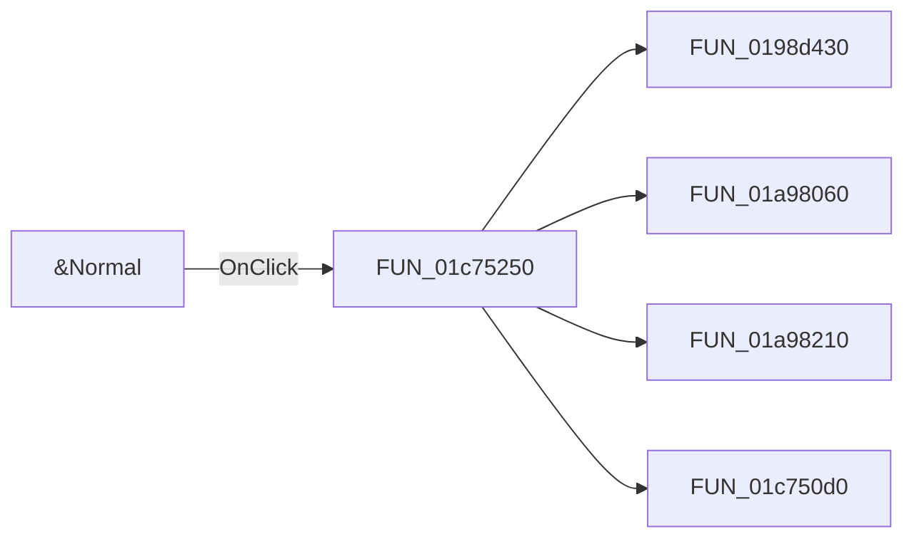

# &Normal

> Analysis status: Pending individual source review.

## Control

| Property | Recovered value |
| --- | --- |
| Form | SchematicEditor |
| Component path | SchematicEditor.MainMenu.View.Zoom.ZoomNormal |
| Control class | TMenuItem |
| Caption | &Normal |
| Hint | Not present in the recovered resource. |
| Text | Not present in the recovered resource. |
| Handler name | ZoomNormalClick |
| Handler address | 01c75250 |
| Graph node | `resource:dfm:SchematicEditor/SchematicEditor.MainMenu.View.Zoom.ZoomNormal` |
| Handler node | `function:01c75250` |
| Graph layer | UI |

## What happens when clicked

Pending individual analysis. An agent must read the recovered handler source and its relevant callees before it replaces this text.

## Click flow

## Handler evidence

- Source: [DecompiledSources/Tina16/functions/0000000001C75250__FUN_01c75250.c](../../../DecompiledSources/Tina16/functions/0000000001C75250__FUN_01c75250.c)
- Recovered role: Not present in the recovered resource.
- Current graph summary: Handles 1 Delphi UI event: SchematicEditor.MainMenu.View.Zoom.ZoomNormal.OnClick.
- Current graph behavior: Not present in the recovered resource.
- Current graph evidence: Not present in the recovered resource.
- Complexity: complex
- Distinct outgoing calls: 4

## Direct calls

- `function:0198d430` — FUN_0198d430
- `function:01a98060` — FUN_01a98060
- `function:01a98210` — FUN_01a98210
- `function:01c750d0` — FUN_01c750d0

## Resource evidence

- Kind: Not present in the recovered resource.
- Modal result: Not present in the recovered resource.
- Checked state: Not present in the recovered resource.
- List items: Not present in the recovered resource.
- Image reference: Not present in the recovered resource.
- Extracted glyph: None.

## Nearby label candidates

Nearby labels are layout candidates only. They are not proof of behavior.

- No same-parent label candidate is available.

## Analysis limits

- Do not infer behavior from the control class, caption, hint, glyph, or nearby label alone.
- Do not replace the pending status until the handler source and relevant call path provide enough evidence.
