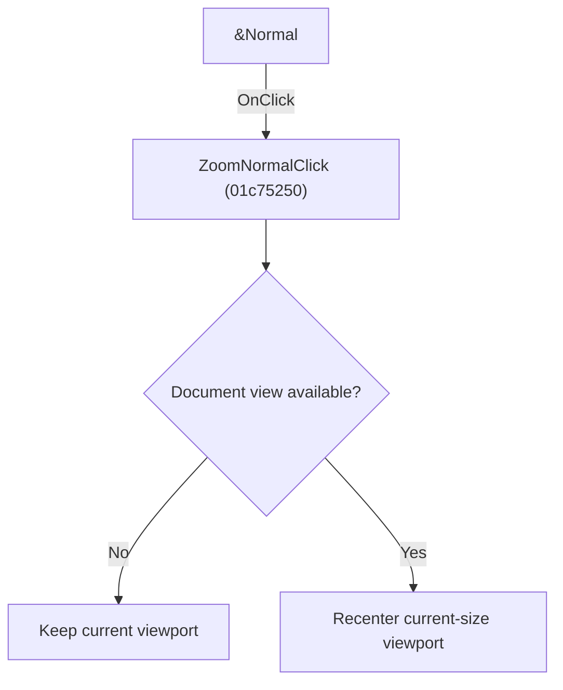

# &Normal

> Analysis status: Individually reviewed.

## Control

| Property | Recovered value |
| --- | --- |
| Form | SchematicEditor |
| Component path | SchematicEditor.MainMenu.View.Zoom.ZoomNormal |
| Control class | TMenuItem |
| Caption | &Normal |
| Hint | Not present in the recovered resource. |
| Text | Not present in the recovered resource. |
| Handler name | ZoomNormalClick |
| Handler address | 01c75250 |
| Graph node | `resource:dfm:SchematicEditor/SchematicEditor.MainMenu.View.Zoom.ZoomNormal` |
| Handler node | `function:01c75250` |
| Graph layer | UI |

## What happens when clicked

When a document view is available, the handler keeps the current visible width and height, recenters that rectangle on the schematic center, and applies the resulting viewport. Without a view, it returns without changing zoom.

## Click flow

## Handler evidence

- Source: [DecompiledSources/Tina16/functions/0000000001C75250__FUN_01c75250.c](../../../DecompiledSources/Tina16/functions/0000000001C75250__FUN_01c75250.c)
- Recovered role: Restore normal zoom around the schematic center.
- Current graph summary: Handles 1 Delphi UI event: SchematicEditor.MainMenu.View.Zoom.ZoomNormal.OnClick.
- Current graph behavior: When a document view is available, the handler keeps the current visible width and height, recenters that rectangle on the schematic center, and applies the resulting viewport. Without a view, it returns without changing zoom.
- Current graph evidence: The recovered body checks the document/view pointers, calculates half-width and half-height from the current viewport, combines them with the document center, and passes the new rectangle to the viewport helper. The menu caption is Normal.
- Complexity: complex
- Distinct outgoing calls: 4

## Direct calls

- `function:0198d430` — FUN_0198d430
- `function:01a98060` — FUN_01a98060
- `function:01a98210` — FUN_01a98210
- `function:01c750d0` — FUN_01c750d0

## Resource evidence

- Kind: Not present in the recovered resource.
- Modal result: Not present in the recovered resource.
- Checked state: Not present in the recovered resource.
- List items: Not present in the recovered resource.
- Image reference: Not present in the recovered resource.
- Extracted glyph: None.

## Nearby label candidates

Nearby labels are layout candidates only. They are not proof of behavior.

- No same-parent label candidate is available.

## Analysis limits

- The recovered source exposes viewport members by offset.

