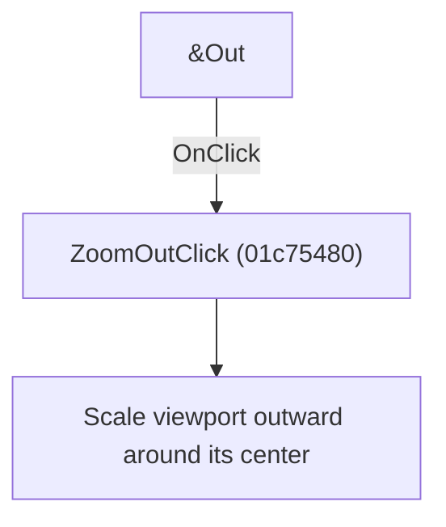

# &Out

> Analysis status: Individually reviewed.

## Control

| Property | Recovered value |
| --- | --- |
| Form | SchematicEditor |
| Component path | SchematicEditor.MainMenu.View.Zoom.ZoomOut |
| Control class | TMenuItem |
| Caption | &Out |
| Hint | Not present in the recovered resource. |
| Text | Not present in the recovered resource. |
| Handler name | ZoomOutClick |
| Handler address | 01c75480 |
| Graph node | `resource:dfm:SchematicEditor/SchematicEditor.MainMenu.View.Zoom.ZoomOut` |
| Handler node | `function:01c75480` |
| Graph layer | UI |

## What happens when clicked

The handler obtains the current viewport center and applies the recovered zoom-out factor around that point.

## Click flow

## Handler evidence

- Source: [DecompiledSources/Tina16/functions/0000000001C75480__FUN_01c75480.c](../../../DecompiledSources/Tina16/functions/0000000001C75480__FUN_01c75480.c)
- Recovered role: Zoom out around the viewport center.
- Current graph summary: Handles 1 Delphi UI event: SchematicEditor.MainMenu.View.Zoom.ZoomOut.OnClick.
- Current graph behavior: The handler obtains the current viewport center and applies the recovered zoom-out factor around that point.
- Current graph evidence: The body reads the view state, calculates its center through a helper, and calls the scale operation with the zoom-out constant. The menu caption is Out.
- Complexity: complex
- Distinct outgoing calls: 3

## Direct calls

- `function:00807f70` — FUN_00807f70
- `function:00807f90` — FUN_00807f90
- `function:01c74cf0` — FUN_01c74cf0

## Resource evidence

- Kind: Not present in the recovered resource.
- Modal result: Not present in the recovered resource.
- Checked state: Not present in the recovered resource.
- List items: Not present in the recovered resource.
- Image reference: Not present in the recovered resource.
- Extracted glyph: None.

## Nearby label candidates

Nearby labels are layout candidates only. They are not proof of behavior.

- No same-parent label candidate is available.

## Analysis limits

- The exact numeric scale factor is expressed through recovered floating-point data rather than a named constant.

