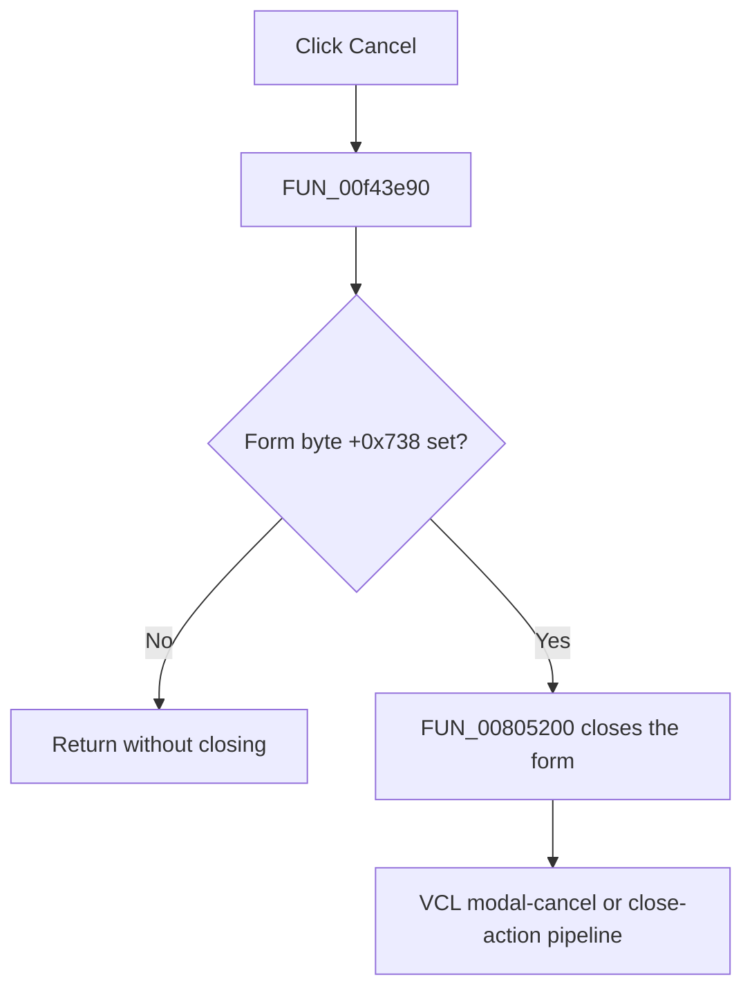

# BitBtn2

> Analysis status: Complete. The form-state guard and recovered VCL close routine establish the close and no-op paths.

## Control

| Property | Recovered value |
| --- | --- |
| Form | SchPropertyEditor |
| Component path | SchPropertyEditor.BottomPanel.BitBtn2 |
| Control class | TBitBtn |
| Caption | Not present in the recovered resource. |
| Hint | Not present in the recovered resource. |
| Text | Not present in the recovered resource. |
| Handler name | BitBtn2Click |
| Handler address | 00f43e90 |
| Graph node | `resource:dfm:SchPropertyEditor/SchPropertyEditor.BottomPanel.BitBtn2` |
| Handler node | `function:00f43e90` |
| Graph layer | UI |

## What happens when clicked

`FUN_00f43e90` reads form state byte `+0x738`. When it is zero, the handler returns without a call or state change. When it is nonzero, the handler calls `FUN_00805200`, the recovered VCL form close routine.

For a modal form, that close routine sets `mrCancel`. For a modeless form, it runs close query and the form close-action pipeline. The `bkCancel` resource kind supports the cancel intent, but the handler source establishes the `+0x738` guard.

## Click flow

## Handler evidence

- Source: [DecompiledSources/Tina16/functions/0000000000F43E90__FUN_00f43e90.c](../../../DecompiledSources/Tina16/functions/0000000000F43E90__FUN_00f43e90.c)
- Recovered role: Closes SchPropertyEditor only when form state byte +0x738 is set.
- Current graph summary: Handles 1 Delphi UI event: SchPropertyEditor.BottomPanel.BitBtn2.OnClick.
- Current graph behavior: Not present in the recovered resource.
- Current graph evidence: Not present in the recovered resource.
- Complexity: simple
- Distinct outgoing calls: 1

## Direct calls

- `function:00805200` — FUN_00805200

## Resource evidence

- Kind: bkCancel
- Modal result: Not present in the recovered resource.
- Checked state: Not present in the recovered resource.
- List items: Not present in the recovered resource.
- Image reference: Not present in the recovered resource.
- Extracted glyph: None.

## Nearby label candidates

Nearby labels are layout candidates only. They are not proof of behavior.

- No same-parent label candidate is available.

## Analysis limits

- The Delphi name and higher-level meaning of form byte `+0x738` are not recovered.
- The built-in `bkCancel` kind does not override the explicit handler no-op when `+0x738` is clear.
