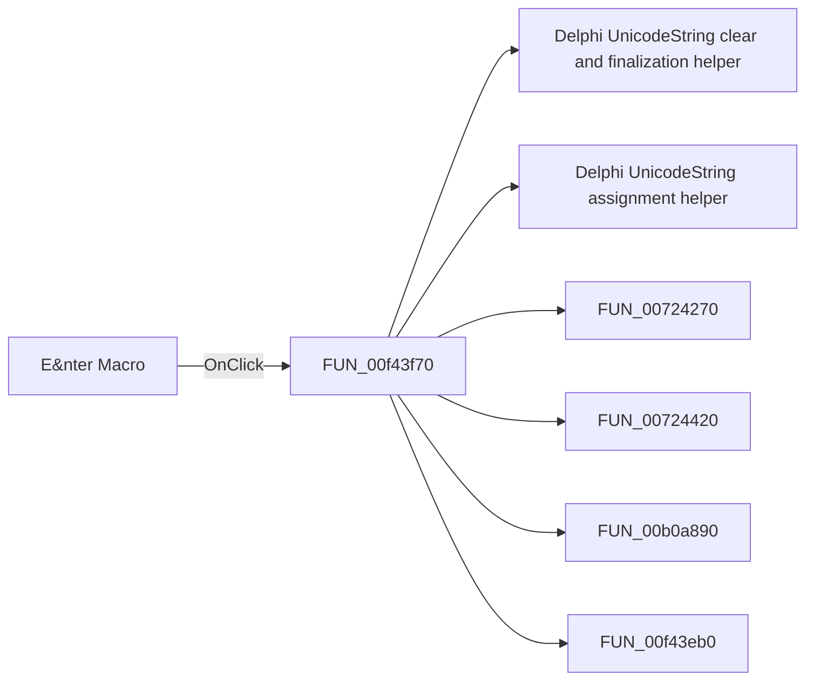

# E&nter Macro

> Analysis status: Pending individual source review.

## Control

| Property | Recovered value |
| --- | --- |
| Form | SchPropertyEditor |
| Component path | SchPropertyEditor.BottomPanel.btnOpenMacro |
| Control class | TButton |
| Caption | E&nter Macro |
| Hint | Not present in the recovered resource. |
| Text | Not present in the recovered resource. |
| Handler name | btnOpenMacroClick |
| Handler address | 00f43f70 |
| Graph node | `resource:dfm:SchPropertyEditor/SchPropertyEditor.BottomPanel.btnOpenMacro` |
| Handler node | `function:00f43f70` |
| Graph layer | UI |

## What happens when clicked

Pending individual analysis. An agent must read the recovered handler source and its relevant callees before it replaces this text.

## Click flow

## Handler evidence

- Source: [DecompiledSources/Tina16/functions/0000000000F43F70__FUN_00f43f70.c](../../../DecompiledSources/Tina16/functions/0000000000F43F70__FUN_00f43f70.c)
- Recovered role: Not present in the recovered resource.
- Current graph summary: Handles 1 Delphi UI event: SchPropertyEditor.BottomPanel.btnOpenMacro.OnClick.
- Current graph behavior: Not present in the recovered resource.
- Current graph evidence: Not present in the recovered resource.
- Complexity: complex
- Distinct outgoing calls: 13

## Direct calls

- `function:00414480` — Delphi UnicodeString clear and finalization helper
- `function:00414ad0` — Delphi UnicodeString assignment helper
- `function:00724270` — FUN_00724270
- `function:00724420` — FUN_00724420
- `function:00b0a890` — FUN_00b0a890
- `function:00f43eb0` — FUN_00f43eb0
- `function:017002a0` — FUN_017002a0
- `function:01b22c50` — FUN_01b22c50
- `function:01d42070` — FUN_01d42070
- `function:01d420a0` — FUN_01d420a0
- `function:01d420d0` — FUN_01d420d0
- `function:01d420e0` — FUN_01d420e0
- `function:01d420f0` — FUN_01d420f0

## Resource evidence

- Kind: Not present in the recovered resource.
- Modal result: Not present in the recovered resource.
- Checked state: Not present in the recovered resource.
- List items: Not present in the recovered resource.
- Image reference: Not present in the recovered resource.
- Extracted glyph: None.

## Nearby label candidates

Nearby labels are layout candidates only. They are not proof of behavior.

- No same-parent label candidate is available.

## Analysis limits

- Do not infer behavior from the control class, caption, hint, glyph, or nearby label alone.
- Do not replace the pending status until the handler source and relevant call path provide enough evidence.
