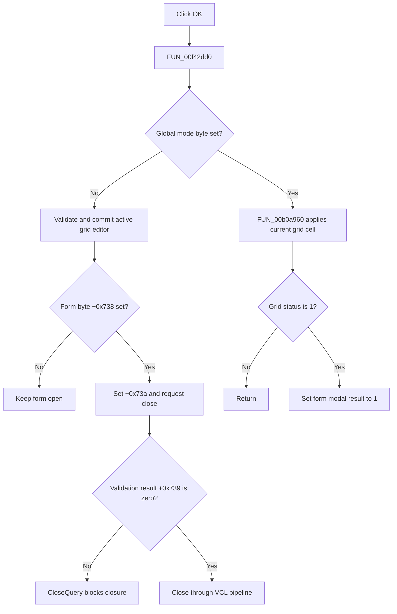

# OKBtn

> Analysis status: Complete. The operating-mode branch, grid commit result, close-query state, and modal-result update establish the action.

## Control

| Property | Recovered value |
| --- | --- |
| Form | SchPropertyEditor |
| Component path | SchPropertyEditor.BottomPanel.OKBtn |
| Control class | TBitBtn |
| Caption | Not present in the recovered resource. |
| Hint | Not present in the recovered resource. |
| Text | Not present in the recovered resource. |
| Handler name | OKBtnClick |
| Handler address | 00f42dd0 |
| Graph node | `resource:dfm:SchPropertyEditor/SchPropertyEditor.BottomPanel.OKBtn` |
| Handler node | `function:00f42dd0` |
| Graph layer | UI |

## What happens when clicked

`FUN_00f42dd0` first branches on global mode byte `PTR_DAT_020039a8`. When that byte is zero, it calls `FUN_00b0a890` to validate and commit the active AttributeGrid cell editor and stores the returned validation result at form byte `+0x739`. If form byte `+0x738` is set, it also sets acceptance byte `+0x73a` and requests form closure through `FUN_00805200`.

`FormCloseQuery` permits that closure only when `+0x739` is zero, then clears the byte. A nonzero validation result therefore blocks this close attempt. When the global mode byte is nonzero, the handler calls `FUN_00b0a960`; if the grid status at `+0x638` becomes 1, it writes 1 to the form modal-result field at `+0x508`. This branch does not call the close routine directly.

## Click flow

## Handler evidence

- Source: [DecompiledSources/Tina16/functions/0000000000F42DD0__FUN_00f42dd0.c](../../../DecompiledSources/Tina16/functions/0000000000F42DD0__FUN_00f42dd0.c)
- Recovered role: Commits the active property-grid edit and accepts or closes the editor according to its operating mode.
- Current graph summary: Handles 1 Delphi UI event: SchPropertyEditor.BottomPanel.OKBtn.OnClick.
- Current graph behavior: Not present in the recovered resource.
- Current graph evidence: Not present in the recovered resource.
- Complexity: complex
- Distinct outgoing calls: 3

## Direct calls

- `function:00805200` — FUN_00805200
- `function:00b0a890` — FUN_00b0a890
- `function:00b0a960` — FUN_00b0a960

## Resource evidence

- Kind: bkOK
- Modal result: Not present in the recovered resource.
- Checked state: Not present in the recovered resource.
- List items: Not present in the recovered resource.
- Image reference: Not present in the recovered resource.
- Extracted glyph: None.

## Nearby label candidates

Nearby labels are layout candidates only. They are not proof of behavior.

- No same-parent label candidate is available.

## Analysis limits

- The Delphi names of the two operating-mode bytes and form bytes `+0x738` through `+0x73a` are not recovered.
- Grid validation messages and input parsing occur inside the AttributeGrid editor routines.
