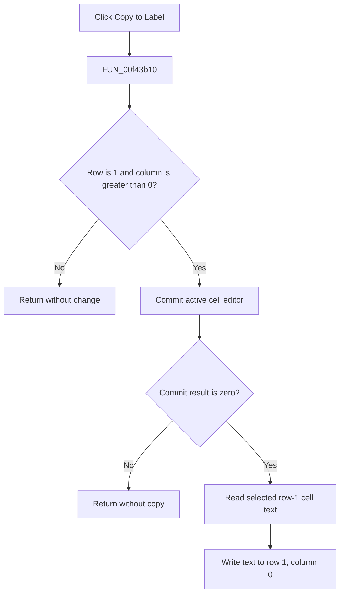

# Copy to &Label

> Analysis status: Complete. The selected-cell guard, active-editor commit, grid text read, and destination write establish the action.

## Control

| Property | Recovered value |
| --- | --- |
| Form | SchPropertyEditor |
| Component path | SchPropertyEditor.GridPopup.pmCopyToLabel |
| Control class | TMenuItem |
| Caption | Copy to &Label |
| Hint | Not present in the recovered resource. |
| Text | Not present in the recovered resource. |
| Handler name | pmCopyToLabelClick |
| Handler address | 00f43b10 |
| Graph node | `resource:dfm:SchPropertyEditor/SchPropertyEditor.GridPopup.pmCopyToLabel` |
| Handler node | `function:00f43b10` |
| Graph layer | UI |

## What happens when clicked

`FUN_00f43b10` reads the AttributeGrid at form offset `+0x6d0`. It continues only when the selected row is 1 and the selected column is greater than 0. Other selections are a proven no-op; the popup-open handler uses the same condition to enable this menu item.

For an eligible selection, `FUN_00b0a360` commits the active cell editor. A nonzero commit result stops the copy. On success, `FUN_0084e320` reads the text from row 1 at the selected column, and `FUN_00b0b450` writes that text to row 1, column 0 and updates the grid's underlying data and active-editor state as applicable.

## Click flow

## Handler evidence

- Source: [DecompiledSources/Tina16/functions/0000000000F43B10__FUN_00f43b10.c](../../../DecompiledSources/Tina16/functions/0000000000F43B10__FUN_00f43b10.c)
- Recovered role: Copies the selected row-1 property value to the row-1 label cell.
- Current graph summary: Handles 1 Delphi UI event: SchPropertyEditor.GridPopup.pmCopyToLabel.OnClick.
- Current graph behavior: Not present in the recovered resource.
- Current graph evidence: Not present in the recovered resource.
- Complexity: complex
- Distinct outgoing calls: 4

## Direct calls

- `function:00414480` — Delphi UnicodeString clear and finalization helper
- `function:0084e320` — FUN_0084e320
- `function:00b0a360` — FUN_00b0a360
- `function:00b0b450` — FUN_00b0b450

## Resource evidence

- Kind: Not present in the recovered resource.
- Modal result: Not present in the recovered resource.
- Checked state: Not present in the recovered resource.
- List items: Not present in the recovered resource.
- Image reference: Not present in the recovered resource.
- Extracted glyph: None.

## Nearby label candidates

Nearby labels are layout candidates only. They are not proof of behavior.

- No same-parent label candidate is available.

## Analysis limits

- The recovered grid code identifies the destination by row and column, not by a Delphi field name.
- Any validation message for a failed active-cell commit is handled inside the grid editor.
