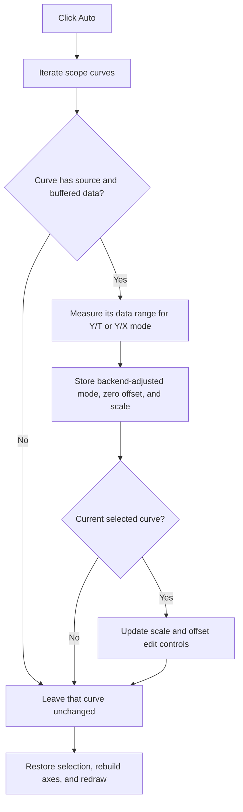

# Auto

> Analysis status: Recovered curve iteration, automatic range calculation, backend update, and plot refresh reviewed.

## Control

| Property | Recovered value |
| --- | --- |
| Form | ScopeWin |
| Component path | ScopeWin.AutoBtnPanel.AutoBtn |
| Control class | TSpeedButton |
| Caption | Auto |
| Hint | Not present in the recovered resource. |
| Text | Not present in the recovered resource. |
| Handler name | AutoBtnClick |
| Handler address | 012b1960 |
| Graph node | `resource:dfm:ScopeWin/ScopeWin.AutoBtnPanel.AutoBtn` |
| Handler node | `function:012b1960` |
| Graph layer | UI |

## What happens when clicked

The handler iterates every curve in the scope's channel collection. It skips a curve unless both its source and buffered data pointers exist. For each usable curve, it creates a range calculator for the current Y/T or Y/X mode, measures the curve data, derives a vertical scale from the measured span and the recovered number of vertical divisions, and sends that proposed scale to the scope backend.

The backend can return an adjusted channel mode flag. The handler stores that flag, vertical offset zero, and the calculated scale in the curve model. For the currently selected curve, it also writes the scale and offset into the two numeric edit controls. After all curves, it restores the selected channel in the backend, rebuilds the plot axes, reapplies the current display mode, and redraws the plot.

Curves without source or data are unchanged. The handler has no local error message or rollback.

## Click flow

## Handler evidence

- Source: [DecompiledSources/Tina16/functions/00000000012B1960__FUN_012b1960.c](../../../DecompiledSources/Tina16/functions/00000000012B1960__FUN_012b1960.c)
- Recovered role: Not present in the recovered resource.
- Current graph summary: Handles 1 Delphi UI event: ScopeWin.AutoBtnPanel.AutoBtn.OnClick.
- Current graph behavior: Not present in the recovered resource.
- Current graph evidence: Not present in the recovered resource.
- Complexity: complex
- Distinct outgoing calls: 9

## Direct calls

- `function:0040c850` — FUN_0040c850
- `function:00410f20` — Nil-safe Delphi object destruction helper
- `function:004113f0` — FUN_004113f0
- `function:00b90440` — FUN_00b90440
- `function:00b90620` — FUN_00b90620
- `function:010f67e0` — FUN_010f67e0
- `function:012ae470` — FUN_012ae470
- `function:01cc6020` — FUN_01cc6020
- `function:01cc6f70` — FUN_01cc6f70

## Resource evidence

- Kind: Not present in the recovered resource.
- Modal result: Not present in the recovered resource.
- Checked state: Not present in the recovered resource.
- List items: Not present in the recovered resource.
- Image reference: Not present in the recovered resource.
- Extracted glyph: None.

## Nearby label candidates

Nearby labels are layout candidates only. They are not proof of behavior.

- No same-parent label candidate is available.

## Analysis limits

- Do not infer behavior from the control class, caption, hint, glyph, or nearby label alone.
- The original class names of the two mode-specific range calculators are not recovered.
