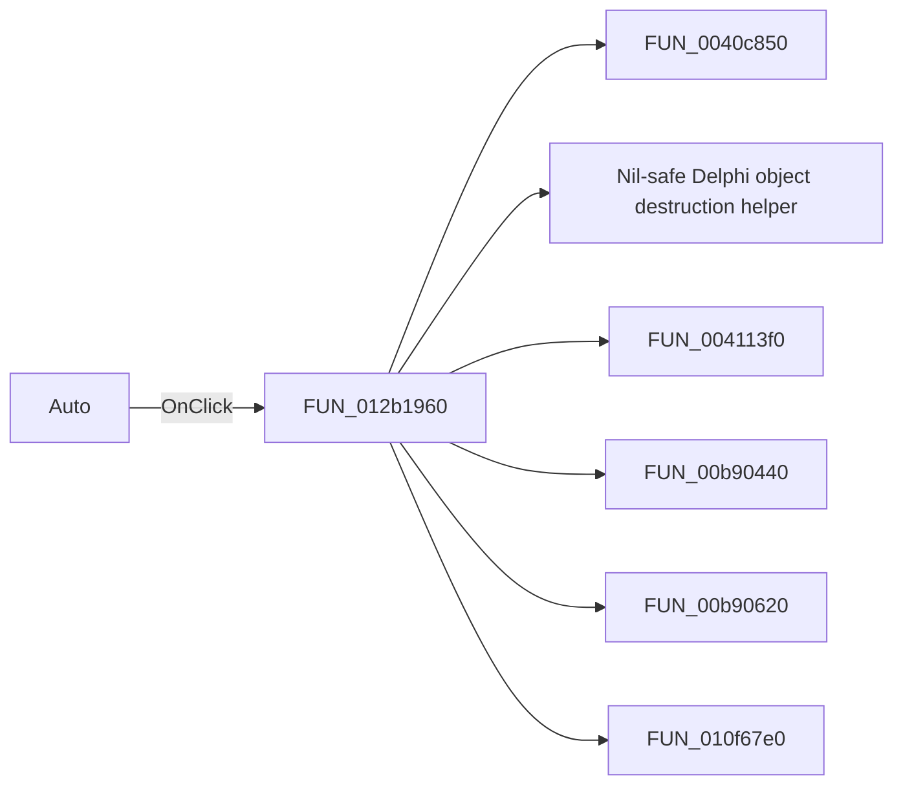

# Auto

> Analysis status: Pending individual source review.

## Control

| Property | Recovered value |
| --- | --- |
| Form | ScopeWin |
| Component path | ScopeWin.AutoBtnPanel.AutoBtn |
| Control class | TSpeedButton |
| Caption | Auto |
| Hint | Not present in the recovered resource. |
| Text | Not present in the recovered resource. |
| Handler name | AutoBtnClick |
| Handler address | 012b1960 |
| Graph node | `resource:dfm:ScopeWin/ScopeWin.AutoBtnPanel.AutoBtn` |
| Handler node | `function:012b1960` |
| Graph layer | UI |

## What happens when clicked

Pending individual analysis. An agent must read the recovered handler source and its relevant callees before it replaces this text.

## Click flow

## Handler evidence

- Source: [DecompiledSources/Tina16/functions/00000000012B1960__FUN_012b1960.c](../../../DecompiledSources/Tina16/functions/00000000012B1960__FUN_012b1960.c)
- Recovered role: Not present in the recovered resource.
- Current graph summary: Handles 1 Delphi UI event: ScopeWin.AutoBtnPanel.AutoBtn.OnClick.
- Current graph behavior: Not present in the recovered resource.
- Current graph evidence: Not present in the recovered resource.
- Complexity: complex
- Distinct outgoing calls: 9

## Direct calls

- `function:0040c850` — FUN_0040c850
- `function:00410f20` — Nil-safe Delphi object destruction helper
- `function:004113f0` — FUN_004113f0
- `function:00b90440` — FUN_00b90440
- `function:00b90620` — FUN_00b90620
- `function:010f67e0` — FUN_010f67e0
- `function:012ae470` — FUN_012ae470
- `function:01cc6020` — FUN_01cc6020
- `function:01cc6f70` — FUN_01cc6f70

## Resource evidence

- Kind: Not present in the recovered resource.
- Modal result: Not present in the recovered resource.
- Checked state: Not present in the recovered resource.
- List items: Not present in the recovered resource.
- Image reference: Not present in the recovered resource.
- Extracted glyph: None.

## Nearby label candidates

Nearby labels are layout candidates only. They are not proof of behavior.

- No same-parent label candidate is available.

## Analysis limits

- Do not infer behavior from the control class, caption, hint, glyph, or nearby label alone.
- Do not replace the pending status until the handler source and relevant call path provide enough evidence.
