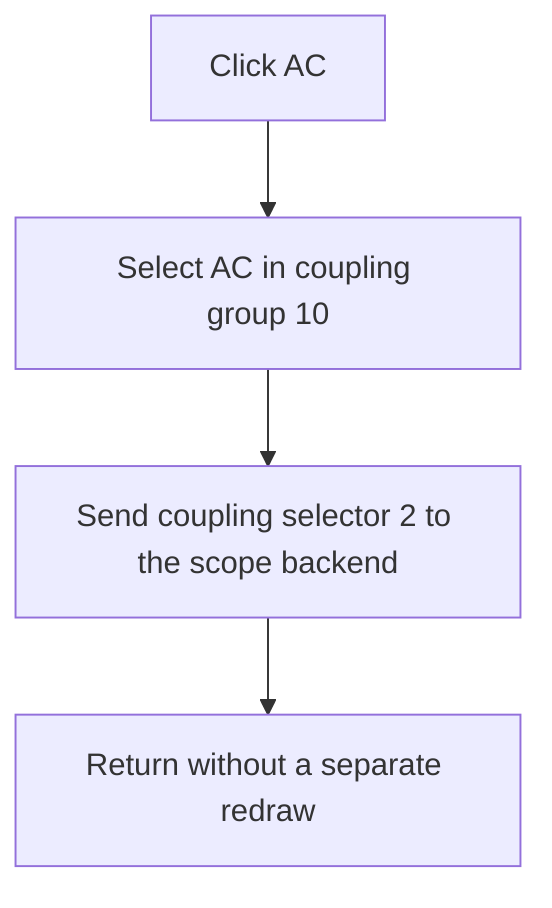

# AC

> Analysis status: Recovered exclusive coupling selection and backend selector call reviewed.

## Control

| Property | Recovered value |
| --- | --- |
| Form | ScopeWin |
| Component path | ScopeWin.ChannelGroupBox.CouplingGroupBox.CouplingACBtn |
| Control class | TSpeedButton |
| Caption | AC |
| Hint | Not present in the recovered resource. |
| Text | Not present in the recovered resource. |
| Handler name | CouplingACBtnClick |
| Handler address | 012af6e0 |
| Graph node | `resource:dfm:ScopeWin/ScopeWin.ChannelGroupBox.CouplingGroupBox.CouplingACBtn` |
| Handler node | `function:012af6e0` |
| Graph layer | UI |

## What happens when clicked

The three coupling buttons share speed-button group 10, so selecting **AC** releases the other coupling button. The handler sends fixed selector value 2 to virtual slot `+0x140` on the scope backend at form field `+0xdb8`.

The code contains no validation, redraw call, or local error branch. The resource caption maps this control to AC. The original enum name and the backend implementation of selector 2 are not recovered.

## Click flow

## Handler evidence

- Source: [DecompiledSources/Tina16/functions/00000000012AF6E0__FUN_012af6e0.c](../../../DecompiledSources/Tina16/functions/00000000012AF6E0__FUN_012af6e0.c)
- Recovered role: Not present in the recovered resource.
- Current graph summary: Handles 1 Delphi UI event: ScopeWin.ChannelGroupBox.CouplingGroupBox.CouplingACBtn.OnClick.
- Current graph behavior: Not present in the recovered resource.
- Current graph evidence: Not present in the recovered resource.
- Complexity: simple
- Distinct outgoing calls: 0

## Direct calls

- No direct call edge is present in the recovered graph.

## Resource evidence

- Kind: Not present in the recovered resource.
- Modal result: Not present in the recovered resource.
- Checked state: Not present in the recovered resource.
- List items: Not present in the recovered resource.
- Image reference: Not present in the recovered resource.
- Extracted glyph: None.

## Nearby label candidates

Nearby labels are layout candidates only. They are not proof of behavior.

- No same-parent label candidate is available.

## Analysis limits

- Do not infer behavior from the control class, caption, hint, glyph, or nearby label alone.
- The virtual backend target is unresolved; the recovered code proves selector 2, but not its device-level implementation.
