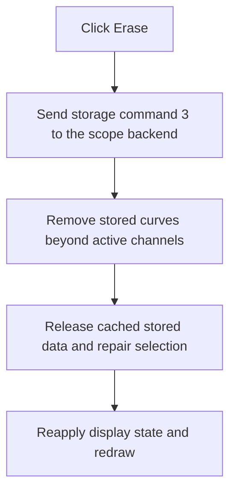

# Erase

> Analysis status: Recovered backend erase command, stored-curve trimming, state reconciliation, and redraw reviewed.

## Control

| Property | Recovered value |
| --- | --- |
| Form | ScopeWin |
| Component path | ScopeWin.StorageGroupBox.EraseBtn |
| Control class | TSpeedButton |
| Caption | Erase |
| Hint | Not present in the recovered resource. |
| Text | Not present in the recovered resource. |
| Handler name | EraseBtnClick |
| Handler address | 012b1db0 |
| Graph node | `resource:dfm:ScopeWin/ScopeWin.StorageGroupBox.EraseBtn` |
| Handler node | `function:012b1db0` |
| Graph layer | UI |

## What happens when clicked

The handler sends fixed storage command 3 to virtual slot `+0x148` on the scope backend. It then runs the shared curve-update routine with reason 2.

That routine removes trailing stored curves until the collection matches the active channel count, releases cached stored data, chooses a valid current channel, reapplies display and cursor state, and redraws the plot. Current live-channel curves remain; the command targets stored traces. There is no confirmation, undo, or local error branch.

## Click flow

## Handler evidence

- Source: [DecompiledSources/Tina16/functions/00000000012B1DB0__FUN_012b1db0.c](../../../DecompiledSources/Tina16/functions/00000000012B1DB0__FUN_012b1db0.c)
- Recovered role: Not present in the recovered resource.
- Current graph summary: Handles 1 Delphi UI event: ScopeWin.StorageGroupBox.EraseBtn.OnClick.
- Current graph behavior: Not present in the recovered resource.
- Current graph evidence: Not present in the recovered resource.
- Complexity: simple
- Distinct outgoing calls: 1

## Direct calls

- `function:012b0230` — FUN_012b0230

## Resource evidence

- Kind: Not present in the recovered resource.
- Modal result: Not present in the recovered resource.
- Checked state: Not present in the recovered resource.
- List items: Not present in the recovered resource.
- Image reference: Not present in the recovered resource.
- Extracted glyph: None.

## Nearby label candidates

Nearby labels are layout candidates only. They are not proof of behavior.

- No same-parent label candidate is available.

## Analysis limits

- Do not infer behavior from the control class, caption, hint, glyph, or nearby label alone.
- The backend implementation of storage command 3 is unresolved; collection trimming proves the local erase effect.
