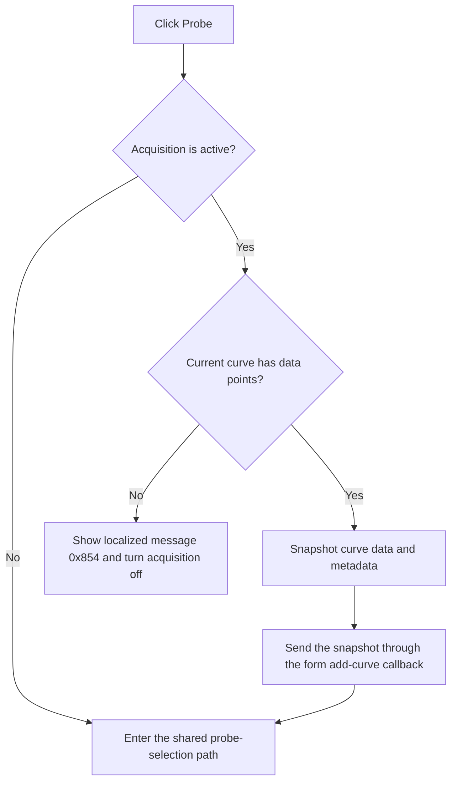

# Probe

> Analysis status: Recovered probe glyph, shared probe dispatcher, curve snapshot, and no-data branch reviewed.

## Control

| Property | Recovered value |
| --- | --- |
| Form | ScopeWin |
| Component path | ScopeWin.ChannelGroupBox.FAddCurvesExBtn |
| Control class | TSpeedButton |
| Caption | Not present in the recovered resource. |
| Hint | Probe |
| Text | Not present in the recovered resource. |
| Handler name | AddCurvesExBtnClick |
| Handler address | 012b23a0 |
| Graph node | `resource:dfm:ScopeWin/ScopeWin.ChannelGroupBox.FAddCurvesExBtn` |
| Handler node | `function:012b23a0` |
| Graph layer | UI |

## What happens when clicked

The resource marks this **Probe** button disabled by default and gives it a probe glyph. Its handler delegates to the shared analyzer probe routine.

When acquisition is inactive, the routine enters the common probe-selection path directly. When acquisition is active and the current curve contains points, it copies the current curve into a temporary list, preserves curve type and name metadata, sends that snapshot through the form's add-curve callback, and then enters the probe-selection path. If acquisition is active but no usable current curve exists, it shows localized message 0x854 and turns the acquisition state off.

The exact probe-selection dialog or schematic interaction after the shared dispatcher is not recovered.

## Click flow

## Handler evidence

- Source: [DecompiledSources/Tina16/functions/00000000012B23A0__FUN_012b23a0.c](../../../DecompiledSources/Tina16/functions/00000000012B23A0__FUN_012b23a0.c)
- Recovered role: Not present in the recovered resource.
- Current graph summary: Handles 1 Delphi UI event: ScopeWin.ChannelGroupBox.FAddCurvesExBtn.OnClick.
- Current graph behavior: Not present in the recovered resource.
- Current graph evidence: Not present in the recovered resource.
- Complexity: simple
- Distinct outgoing calls: 1

## Direct calls

- `function:010fbe80` — FUN_010fbe80

## Resource evidence

- Kind: Not present in the recovered resource.
- Modal result: Not present in the recovered resource.
- Checked state: Not present in the recovered resource.
- List items: Not present in the recovered resource.
- Image reference: Not present in the recovered resource.
- Extracted glyph: [`0387_ScopeWin_ScopeWin_ChannelGroupBox_FAddCurvesExBtn_Glyph_Data.png`](../../../glyph/0387_ScopeWin_ScopeWin_ChannelGroupBox_FAddCurvesExBtn_Glyph_Data.png)

## Nearby label candidates

Nearby labels are layout candidates only. They are not proof of behavior.

- No same-parent label candidate is available.

## Analysis limits

- Do not infer behavior from the control class, caption, hint, glyph, or nearby label alone.
- The resource starts this control disabled, and the recovered path does not show which state later enables it.
