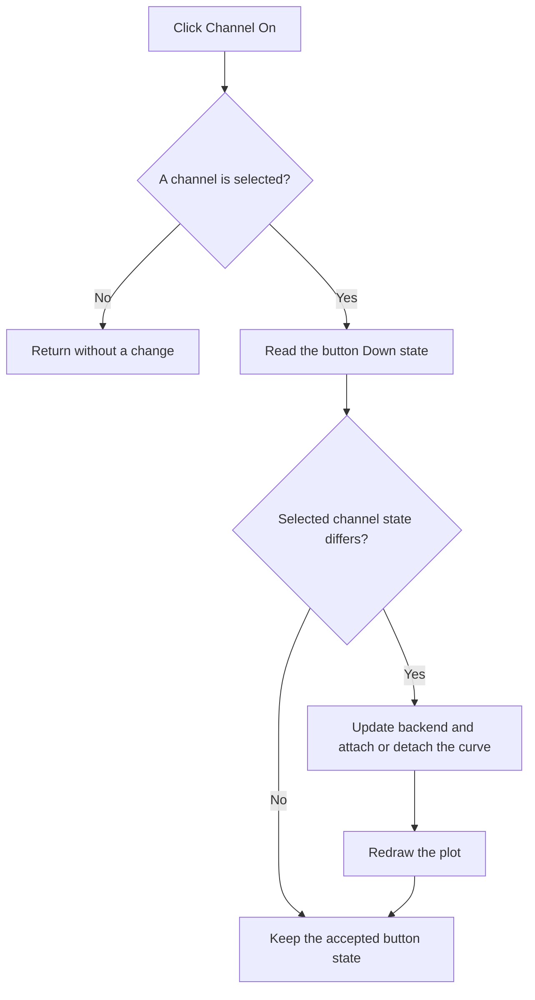

# On

> Analysis status: Recovered selected-channel guard, button-state propagation, curve update, and redraw reviewed.

## Control

| Property | Recovered value |
| --- | --- |
| Form | ScopeWin |
| Component path | ScopeWin.ChannelGroupBox.FChannelOnBtn |
| Control class | TSpeedButton |
| Caption | On |
| Hint | Not present in the recovered resource. |
| Text | Not present in the recovered resource. |
| Handler name | ChannelOnBtnClick |
| Handler address | 012af7d0 |
| Graph node | `resource:dfm:ScopeWin/ScopeWin.ChannelGroupBox.FChannelOnBtn` |
| Handler node | `function:012af7d0` |
| Graph layer | UI |

## What happens when clicked

The handler asks the channel selector for its current index. If no channel is selected, indicated by index `-1`, the click is a no-op.

Otherwise it reads the **On** speed button's current Down state and passes that Boolean to the selected-channel helper. The helper sends the change to the scope backend only when the channel model differs, updates the channel model, attaches or detaches its curve as required, and redraws the plot. The handler then synchronizes the button Down state with the accepted Boolean.

There is no confirmation, error message, or local rollback.

## Click flow

## Handler evidence

- Source: [DecompiledSources/Tina16/functions/00000000012AF7D0__FUN_012af7d0.c](../../../DecompiledSources/Tina16/functions/00000000012AF7D0__FUN_012af7d0.c)
- Recovered role: Not present in the recovered resource.
- Current graph summary: Handles 1 Delphi UI event: ScopeWin.ChannelGroupBox.FChannelOnBtn.OnClick.
- Current graph behavior: Not present in the recovered resource.
- Current graph evidence: Not present in the recovered resource.
- Complexity: moderate
- Distinct outgoing calls: 2

## Direct calls

- `function:0082a6c0` — FUN_0082a6c0
- `function:012af700` — FUN_012af700

## Resource evidence

- Kind: Not present in the recovered resource.
- Modal result: Not present in the recovered resource.
- Checked state: Not present in the recovered resource.
- List items: Not present in the recovered resource.
- Image reference: Not present in the recovered resource.
- Extracted glyph: None.

## Nearby label candidates

Nearby labels are layout candidates only. They are not proof of behavior.

- No same-parent label candidate is available.

## Analysis limits

- Do not infer behavior from the control class, caption, hint, glyph, or nearby label alone.
- The original Boolean property name at channel-model offset +0x11 is not recovered.
