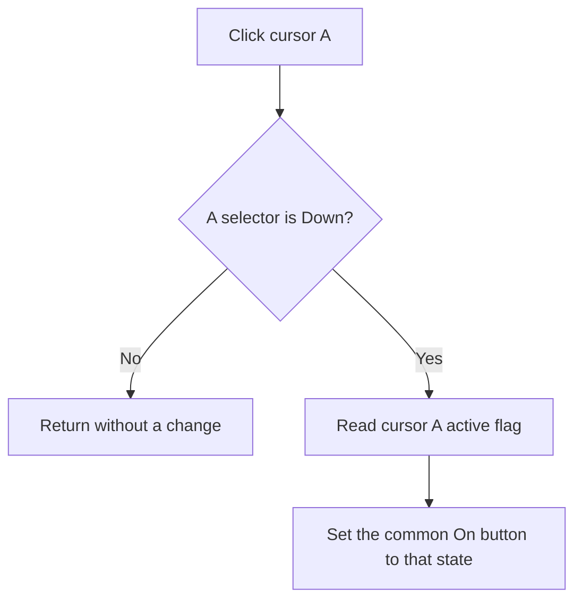

# A

> Analysis status: Recovered A-selector guard and shared cursor On-state synchronization reviewed.

## Control

| Property | Recovered value |
| --- | --- |
| Form | ScopeWin |
| Component path | ScopeWin.CursorBox.FCursorASelectBtn |
| Control class | TSpeedButton |
| Caption | A |
| Hint | Not present in the recovered resource. |
| Text | Not present in the recovered resource. |
| Handler name | CursorASelectBtnClick |
| Handler address | 012b16d0 |
| Graph node | `resource:dfm:ScopeWin/ScopeWin.CursorBox.FCursorASelectBtn` |
| Handler node | `function:012b16d0` |
| Graph layer | UI |

## What happens when clicked

The A and B selector buttons share speed-button group 1. After **A** becomes selected, the handler calls the shared A synchronization helper. That helper reads cursor A's active flag from cursor-controller byte `+0xc0` and applies it to the common cursor **On** button.

If A is not Down when the helper runs, it returns without a change. The click selects which cursor later On and curve-navigation operations address; it does not itself move the cursor or change cursor A's active flag.

## Click flow

## Handler evidence

- Source: [DecompiledSources/Tina16/functions/00000000012B16D0__FUN_012b16d0.c](../../../DecompiledSources/Tina16/functions/00000000012B16D0__FUN_012b16d0.c)
- Recovered role: Not present in the recovered resource.
- Current graph summary: Handles 1 Delphi UI event: ScopeWin.CursorBox.FCursorASelectBtn.OnClick.
- Current graph behavior: Not present in the recovered resource.
- Current graph evidence: Not present in the recovered resource.
- Complexity: simple
- Distinct outgoing calls: 1

## Direct calls

- `function:010f7e00` — FUN_010f7e00

## Resource evidence

- Kind: Not present in the recovered resource.
- Modal result: Not present in the recovered resource.
- Checked state: Not present in the recovered resource.
- List items: Not present in the recovered resource.
- Image reference: Not present in the recovered resource.
- Extracted glyph: None.

## Nearby label candidates

Nearby labels are layout candidates only. They are not proof of behavior.

- No same-parent label candidate is available.

## Analysis limits

- Do not infer behavior from the control class, caption, hint, glyph, or nearby label alone.
- Cursor A's original controller-field name at byte +0xc0 is not recovered.
