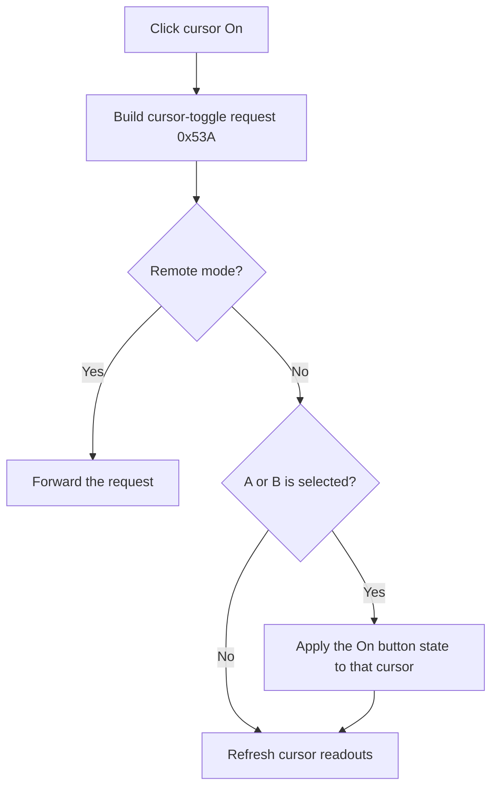

# On

> Analysis status: Recovered selected-cursor toggle state machine and local-or-remote dispatch reviewed.

## Control

| Property | Recovered value |
| --- | --- |
| Form | ScopeWin |
| Component path | ScopeWin.CursorBox.FCursorOnBtn |
| Control class | TSpeedButton |
| Caption | On |
| Hint | Not present in the recovered resource. |
| Text | Not present in the recovered resource. |
| Handler name | CursorOnBtnClick |
| Handler address | 012b16c0 |
| Graph node | `resource:dfm:ScopeWin/ScopeWin.CursorBox.FCursorOnBtn` |
| Handler node | `function:012b16c0` |
| Graph layer | UI |

## What happens when clicked

The handler builds internal request `0x53A` and passes it to the shared cursor-toggle state machine. If the form is in remote mode, the request is forwarded instead of changing local state.

In local mode, the common **On** button's Down state is applied to the selected A or B cursor. Turning a selected cursor off clears its controller flag and removes its display state. Turning it on sets the controller flag and initializes it from the selected curve. If neither A nor B is selected, no cursor flag changes. The helper then refreshes the cursor readouts and plot.

The click does not change the selected curve or save settings.

## Click flow

## Handler evidence

- Source: [DecompiledSources/Tina16/functions/00000000012B16C0__FUN_012b16c0.c](../../../DecompiledSources/Tina16/functions/00000000012B16C0__FUN_012b16c0.c)
- Recovered role: Not present in the recovered resource.
- Current graph summary: Handles 1 Delphi UI event: ScopeWin.CursorBox.FCursorOnBtn.OnClick.
- Current graph behavior: Not present in the recovered resource.
- Current graph evidence: Not present in the recovered resource.
- Complexity: simple
- Distinct outgoing calls: 1

## Direct calls

- `function:010f7c00` — FUN_010f7c00

## Resource evidence

- Kind: Not present in the recovered resource.
- Modal result: Not present in the recovered resource.
- Checked state: Not present in the recovered resource.
- List items: Not present in the recovered resource.
- Image reference: Not present in the recovered resource.
- Extracted glyph: None.

## Nearby label candidates

Nearby labels are layout candidates only. They are not proof of behavior.

- No same-parent label candidate is available.

## Analysis limits

- Do not infer behavior from the control class, caption, hint, glyph, or nearby label alone.
- The transport used for the remote request is outside the recovered helper.
