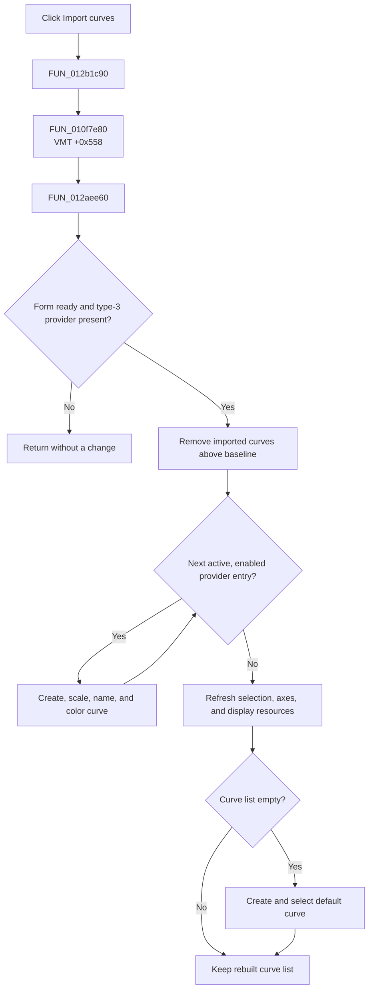

# Import curves

> Analysis status: Evidence-backed source review complete.

## Control

| Property | Recovered value |
| --- | --- |
| Form | ScopeWin |
| Component path | ScopeWin.DataBox.FDataLoadBtn |
| Control class | TSpeedButton |
| Caption | Not present in the recovered resource. |
| Hint | Import curves |
| Text | Not present in the recovered resource. |
| Handler name | DataLoadBtnClick |
| Handler address | 012b1c90 |
| Graph node | `resource:dfm:ScopeWin/ScopeWin.DataBox.FDataLoadBtn` |
| Handler node | `function:012b1c90` |
| Graph layer | UI |

## What happens when clicked

`FUN_012b1c90` calls the common data-load dispatcher `FUN_010f7e80`. That dispatcher invokes virtual slot `+0x558`. The recovered `TScopeWin` VMT starts at `012a7128`, and its entry at `012a7680` resolves this click to [`FUN_012aee60`](../../../DecompiledSources/Tina16/functions/00000000012AEE60__FUN_012aee60.c).

The form-specific method first checks two form-state flags. It also requires a current data provider whose nested type byte is `3`. If a check fails, the method returns without a change. If the checks pass, it removes curve rows above the form's baseline count and detaches their display resources. It then retains the current provider and enumerates its entries. An entry is imported only when its recovered active and enabled bytes are set.

For each accepted entry, the method creates a curve object. It copies the entry name, reads its horizontal and vertical limits through a provider adapter, selects a time-division value for the horizontal span, derives a vertical scale, assigns one of 11 display colors, initializes the curve from the entry and provider, and adds the curve to the list. After the iteration, it restores the baseline selection, refreshes the selected-curve controls and axes, and attaches the new curve display resources. If no curve remains, it creates and selects one default curve from the form's stored default data.

The click does not open a file dialog and does not read a file path. It imports curves from the data provider that is already connected to the Scope window. The recovered method has no local error message, confirmation, transaction, or rollback.

## Click flow

## Handler evidence

- Source: [DecompiledSources/Tina16/functions/00000000012B1C90__FUN_012b1c90.c](../../../DecompiledSources/Tina16/functions/00000000012B1C90__FUN_012b1c90.c)
- Recovered role: Dispatch the Scope window's staged curve-import command.
- Current graph summary: Handles 1 Delphi UI event: ScopeWin.DataBox.FDataLoadBtn.OnClick.
- Current graph behavior: The wrapper calls the shared dispatcher, which invokes the form-specific data-load virtual method.
- Current graph evidence: The `TScopeWin` class-name reference identifies VMT base `012a7128`; slot `+0x558` contains target address `012aee60`. The target body establishes the provider gate, curve creation, scaling, list update, and display refresh behavior.
- Complexity: simple
- Distinct outgoing calls: 1

## Direct calls

- `function:010f7e80` — FUN_010f7e80
- VMT target `function:012aee60` — [FUN_012aee60](../../../DecompiledSources/Tina16/functions/00000000012AEE60__FUN_012aee60.c)
- Target callee `function:010f6740` — [FUN_010f6740](../../../DecompiledSources/Tina16/functions/00000000010F6740__FUN_010f6740.c), detaches a removed curve's display resources.
- Target callee `function:010f67e0` — [FUN_010f67e0](../../../DecompiledSources/Tina16/functions/00000000010F67E0__FUN_010f67e0.c), attaches or updates curve display resources.
- Target callee `function:01107340` — [FUN_01107340](../../../DecompiledSources/Tina16/functions/0000000001107340__FUN_01107340.c), constructs a curve object.
- Target callee `function:012aec90` — [FUN_012aec90](../../../DecompiledSources/Tina16/functions/00000000012AEC90__FUN_012aec90.c), updates the Scope window axes.
- Target callee `function:012aedc0` — [FUN_012aedc0](../../../DecompiledSources/Tina16/functions/00000000012AEDC0__FUN_012aedc0.c), selects a time-division value for a horizontal span.

## Resource evidence

- Kind: Not present in the recovered resource.
- Modal result: Not present in the recovered resource.
- Checked state: Not present in the recovered resource.
- List items: Not present in the recovered resource.
- Image reference: Not present in the recovered resource.
- Extracted glyph: [`0398_ScopeWin_ScopeWin_DataBox_FDataLoadBtn_Glyph_Data.png`](../../../glyph/0398_ScopeWin_ScopeWin_DataBox_FDataLoadBtn_Glyph_Data.png)

## Nearby label candidates

Nearby labels are layout candidates only. They are not proof of behavior.

- No same-parent label candidate is available.

## Analysis limits

- The original Delphi names for the `+0x558` virtual method, the provider type, and its entries are not recovered. This article uses the proven VMT slot, type value `3`, and field behavior.
- The hint and inspected glyph support the import direction. They do not prove a disk file or file format, and the recovered click path contains no file operation.
