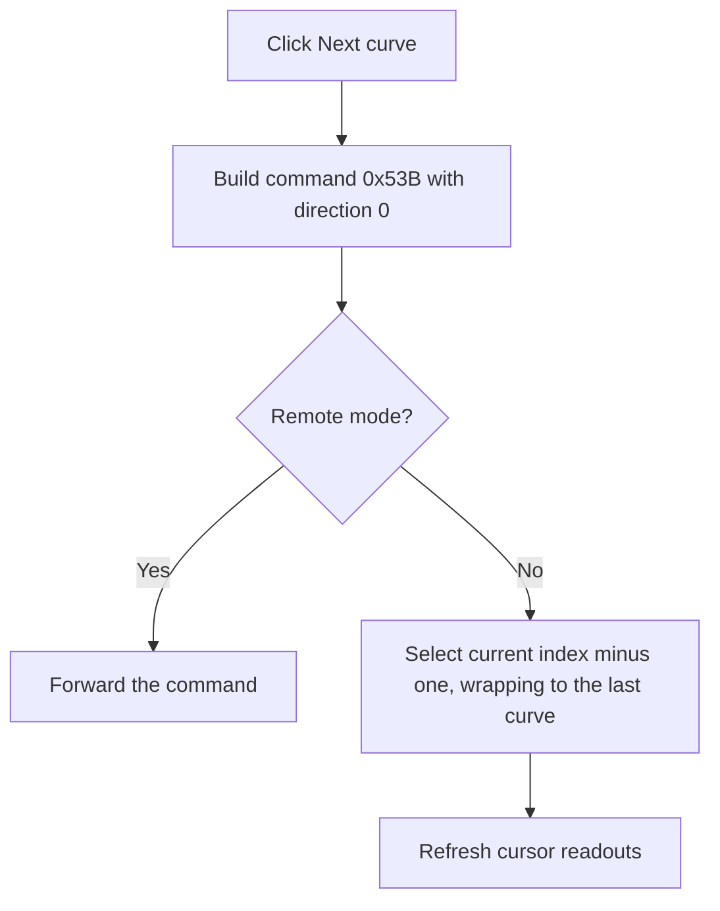

# FNextCurveBtn

> Analysis status: Recovered next-curve command descriptor, wrap route, and local-or-remote dispatch reviewed.

## Control

| Property | Recovered value |
| --- | --- |
| Form | ScopeWin |
| Component path | ScopeWin.CursorBox.FNextCurveBtn |
| Control class | TSpeedButton |
| Caption | Not present in the recovered resource. |
| Hint | Not present in the recovered resource. |
| Text | Not present in the recovered resource. |
| Handler name | NextCurveBtnClick |
| Handler address | 012b16b0 |
| Graph node | `resource:dfm:ScopeWin/ScopeWin.CursorBox.FNextCurveBtn` |
| Handler node | `function:012b16b0` |
| Graph layer | UI |

## What happens when clicked

The handler builds shared cursor-curve command `0x53B` with direction field 0. In local mode, the dispatcher changes the curve assigned to the currently selected cursor through the descending-index route: current index minus one, with wrap to the last curve. It then refreshes cursor readouts. In remote mode, it forwards the command instead.

The extracted glyph points upward. The recovered collection order explains why the internal descending-index route is presented as **Next**.

## Click flow

## Handler evidence

- Source: [DecompiledSources/Tina16/functions/00000000012B16B0__FUN_012b16b0.c](../../../DecompiledSources/Tina16/functions/00000000012B16B0__FUN_012b16b0.c)
- Recovered role: Not present in the recovered resource.
- Current graph summary: Handles 1 Delphi UI event: ScopeWin.CursorBox.FNextCurveBtn.OnClick.
- Current graph behavior: Not present in the recovered resource.
- Current graph evidence: Not present in the recovered resource.
- Complexity: simple
- Distinct outgoing calls: 1

## Direct calls

- `function:010f6d10` — FUN_010f6d10

## Resource evidence

- Kind: Not present in the recovered resource.
- Modal result: Not present in the recovered resource.
- Checked state: Not present in the recovered resource.
- List items: Not present in the recovered resource.
- Image reference: Not present in the recovered resource.
- Extracted glyph: [`0395_ScopeWin_ScopeWin_CursorBox_FNextCurveBtn_Glyph_Data.png`](../../../glyph/0395_ScopeWin_ScopeWin_CursorBox_FNextCurveBtn_Glyph_Data.png)

## Nearby label candidates

Nearby labels are layout candidates only. They are not proof of behavior.

- No same-parent label candidate is available.

## Analysis limits

- Do not infer behavior from the control class, caption, hint, glyph, or nearby label alone.
- The original Delphi enum name for direction 0 is not recovered.
