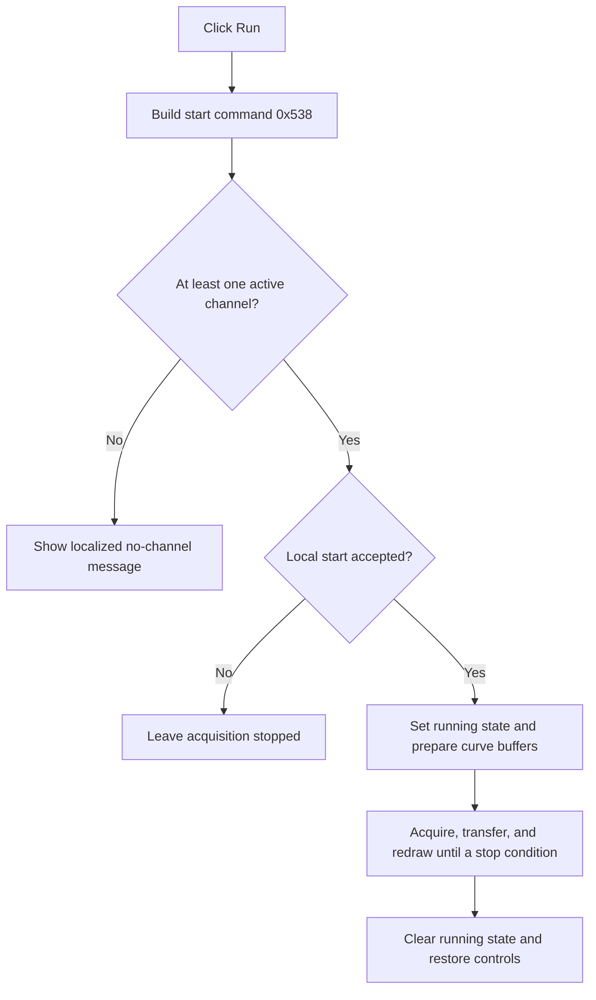

# Run

> Analysis status: Recovered start request, validation guards, acquisition loop, and restoration path reviewed.

## Control

| Property | Recovered value |
| --- | --- |
| Form | ScopeWin |
| Component path | ScopeWin.StorageGroupBox.FStartBtn |
| Control class | TSpeedButton |
| Caption | Run |
| Hint | Not present in the recovered resource. |
| Text | Not present in the recovered resource. |
| Handler name | StartBtnClick |
| Handler address | 012afa80 |
| Graph node | `resource:dfm:ScopeWin/ScopeWin.StorageGroupBox.FStartBtn` |
| Handler node | `function:012afa80` |
| Graph layer | UI |

## What happens when clicked

The handler builds start command `0x538` and passes it to the shared ScopeWin acquisition state machine. If the recovered channel-count byte `+0xd8a` is zero, the state machine leaves Run selected and shows localized message pair `0x106/0x1582`. If a start request is rejected by validation or delegated to an external owner, local acquisition does not begin.

For an accepted local start, it sets the running flag, changes the Run/Stop control state, clears prior acquisition objects, prepares active curves, and enters the scope acquisition loop. Each iteration transfers a new buffer, updates curve state and the plot, and checks stop conditions. On exit it clears the running flag, restores the Run/Stop controls, refreshes the plot, and can close the form when a deferred-close flag is set.

The handler has no local retry after a failed start.

## Click flow

## Handler evidence

- Source: [DecompiledSources/Tina16/functions/00000000012AFA80__FUN_012afa80.c](../../../DecompiledSources/Tina16/functions/00000000012AFA80__FUN_012afa80.c)
- Recovered role: Not present in the recovered resource.
- Current graph summary: Handles 1 Delphi UI event: ScopeWin.StorageGroupBox.FStartBtn.OnClick.
- Current graph behavior: Not present in the recovered resource.
- Current graph evidence: Not present in the recovered resource.
- Complexity: simple
- Distinct outgoing calls: 1

## Direct calls

- `function:012afab0` — FUN_012afab0

## Resource evidence

- Kind: Not present in the recovered resource.
- Modal result: Not present in the recovered resource.
- Checked state: Not present in the recovered resource.
- List items: Not present in the recovered resource.
- Image reference: Not present in the recovered resource.
- Extracted glyph: None.

## Nearby label candidates

Nearby labels are layout candidates only. They are not proof of behavior.

- No same-parent label candidate is available.

## Analysis limits

- Do not infer behavior from the control class, caption, hint, glyph, or nearby label alone.
- Hardware-specific acquisition and validation calls remain unresolved behind virtual interfaces.
