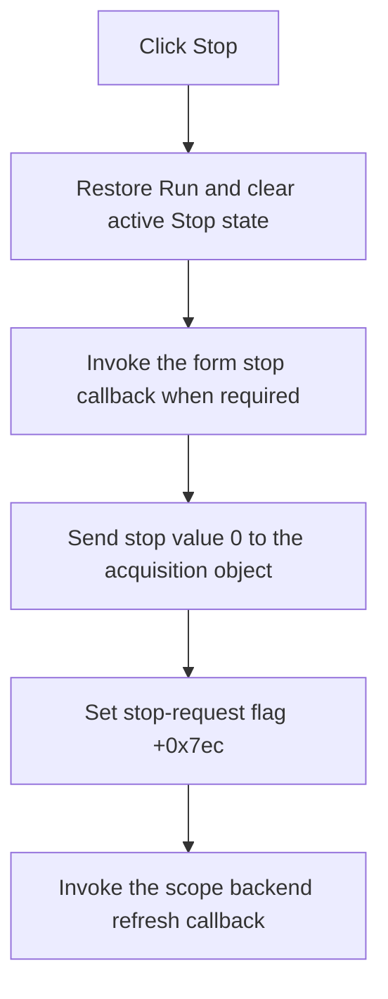

# Stop

> Analysis status: Recovered stop request, control-state update, backend stop, and refresh reviewed.

## Control

| Property | Recovered value |
| --- | --- |
| Form | ScopeWin |
| Component path | ScopeWin.StorageGroupBox.FStopBtn |
| Control class | TSpeedButton |
| Caption | Stop |
| Hint | Not present in the recovered resource. |
| Text | Not present in the recovered resource. |
| Handler name | StopBtnClick |
| Handler address | 012b0090 |
| Graph node | `resource:dfm:ScopeWin/ScopeWin.StorageGroupBox.FStopBtn` |
| Handler node | `function:012b0090` |
| Graph layer | UI |

## What happens when clicked

The handler selects the Run control state first. If the Stop-associated state is active, it clears that state and calls the form's virtual stop callback. It then sends zero to virtual slot `+0x128` on the acquisition object, sets form stop-request flag `+0x7ec` to 1, and invokes the scope backend refresh callback at slot `+0x168`.

The running acquisition loop checks the shared stop state and exits through its normal restoration path. The click does not discard curve data by itself and has no confirmation or local error report.

## Click flow

## Handler evidence

- Source: [DecompiledSources/Tina16/functions/00000000012B0090__FUN_012b0090.c](../../../DecompiledSources/Tina16/functions/00000000012B0090__FUN_012b0090.c)
- Recovered role: Not present in the recovered resource.
- Current graph summary: Handles 1 Delphi UI event: ScopeWin.StorageGroupBox.FStopBtn.OnClick.
- Current graph behavior: Not present in the recovered resource.
- Current graph evidence: Not present in the recovered resource.
- Complexity: simple
- Distinct outgoing calls: 1

## Direct calls

- `function:0082a6c0` — FUN_0082a6c0

## Resource evidence

- Kind: Not present in the recovered resource.
- Modal result: Not present in the recovered resource.
- Checked state: Not present in the recovered resource.
- List items: Not present in the recovered resource.
- Image reference: Not present in the recovered resource.
- Extracted glyph: None.

## Nearby label candidates

Nearby labels are layout candidates only. They are not proof of behavior.

- No same-parent label candidate is available.

## Analysis limits

- Do not infer behavior from the control class, caption, hint, glyph, or nearby label alone.
- The original names of the virtual stop and refresh callbacks are not recovered.
