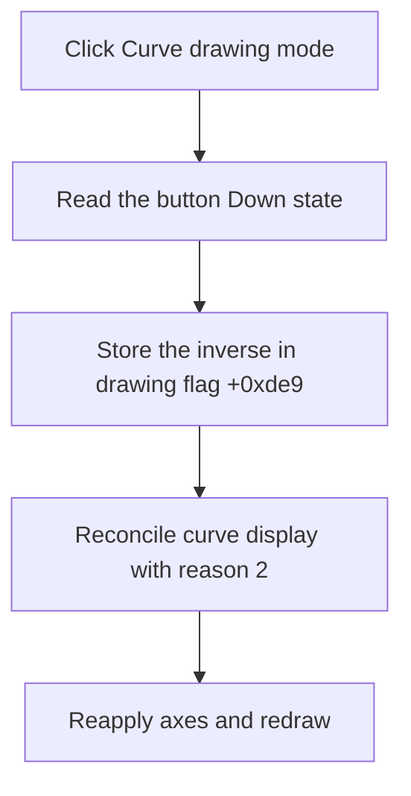

# Curve drawing mode

> Analysis status: Recovered four-glyph drawing-mode toggle and curve-refresh path reviewed.

## Control

| Property | Recovered value |
| --- | --- |
| Form | ScopeWin |
| Component path | ScopeWin.DataBox.Line_DotSpBtn |
| Control class | TSpeedButton |
| Caption | Not present in the recovered resource. |
| Hint | Curve drawing mode |
| Text | Not present in the recovered resource. |
| Handler name | Line_DotSpBtnClick |
| Handler address | 012b1de0 |
| Graph node | `resource:dfm:ScopeWin/ScopeWin.DataBox.Line_DotSpBtn` |
| Handler node | `function:012b1de0` |
| Graph layer | UI |

## What happens when clicked

The button has four glyph states that show line and point variants. On click, the handler reads the speed button's Down state and stores its inverse in form flag `+0xde9`. It then runs the shared curve-update routine with reason 2.

That routine reconciles the displayed curve collection, reapplies plot state and axes, and redraws. The click changes the display style; it does not alter the sampled curve values or publish data.

## Click flow

## Handler evidence

- Source: [DecompiledSources/Tina16/functions/00000000012B1DE0__FUN_012b1de0.c](../../../DecompiledSources/Tina16/functions/00000000012B1DE0__FUN_012b1de0.c)
- Recovered role: Not present in the recovered resource.
- Current graph summary: Handles 1 Delphi UI event: ScopeWin.DataBox.Line_DotSpBtn.OnClick.
- Current graph behavior: Not present in the recovered resource.
- Current graph evidence: Not present in the recovered resource.
- Complexity: simple
- Distinct outgoing calls: 1

## Direct calls

- `function:012b0230` — FUN_012b0230

## Resource evidence

- Kind: Not present in the recovered resource.
- Modal result: Not present in the recovered resource.
- Checked state: Not present in the recovered resource.
- List items: Not present in the recovered resource.
- Image reference: Not present in the recovered resource.
- Extracted glyph: [`0399_ScopeWin_ScopeWin_DataBox_Line_DotSpBtn_Glyph_Data.png`](../../../glyph/0399_ScopeWin_ScopeWin_DataBox_Line_DotSpBtn_Glyph_Data.png)

## Nearby label candidates

Nearby labels are layout candidates only. They are not proof of behavior.

- No same-parent label candidate is available.

## Analysis limits

- Do not infer behavior from the control class, caption, hint, glyph, or nearby label alone.
- The two Boolean flag values are recovered, but their original Delphi line-versus-dot enum names are not.
