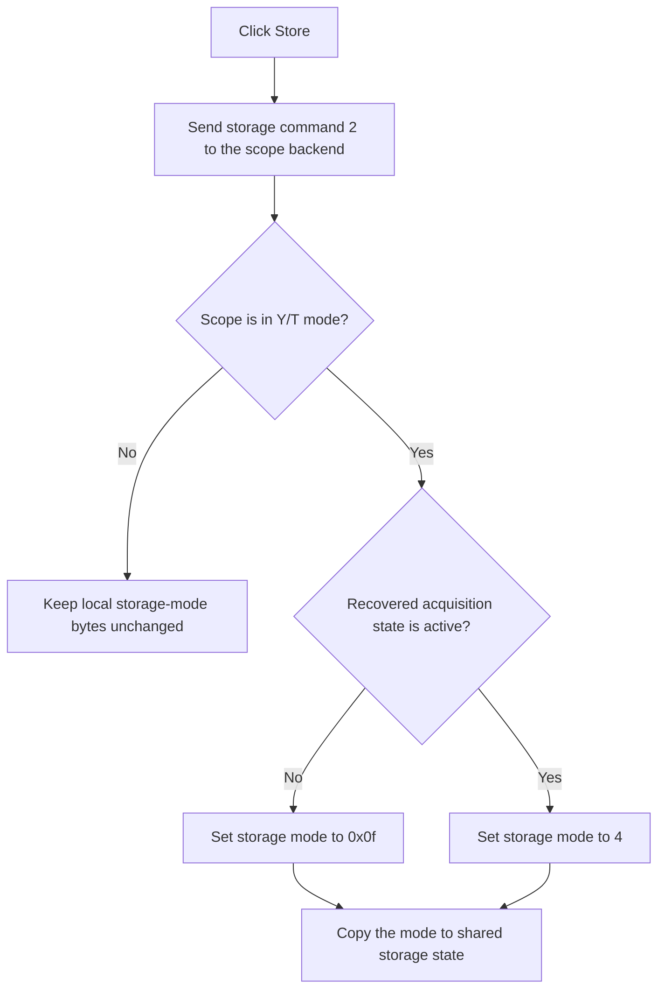

# Store

> Analysis status: Recovered backend store command and captured-storage mode update reviewed.

## Control

| Property | Recovered value |
| --- | --- |
| Form | ScopeWin |
| Component path | ScopeWin.StorageGroupBox.StoreBtn |
| Control class | TSpeedButton |
| Caption | Store |
| Hint | Not present in the recovered resource. |
| Text | Not present in the recovered resource. |
| Handler name | StoreBtnClick |
| Handler address | 012b01d0 |
| Graph node | `resource:dfm:ScopeWin/ScopeWin.StorageGroupBox.StoreBtn` |
| Handler node | `function:012b01d0` |
| Graph layer | UI |

## What happens when clicked

The handler sends fixed storage command 2 to virtual slot `+0x148` on the scope backend. When ScopeWin is in Y/T mode, it also selects a stored-trace mode byte: value `0x0f` when the recovered acquisition-state control is inactive, or value 4 when it is active. It copies that mode to the shared global storage byte.

In Y/X mode, the handler leaves these two local storage bytes unchanged after the backend command. The click does not open a file dialog or publish the curve to the application analysis workspace.

## Click flow

## Handler evidence

- Source: [DecompiledSources/Tina16/functions/00000000012B01D0__FUN_012b01d0.c](../../../DecompiledSources/Tina16/functions/00000000012B01D0__FUN_012b01d0.c)
- Recovered role: Not present in the recovered resource.
- Current graph summary: Handles 1 Delphi UI event: ScopeWin.StorageGroupBox.StoreBtn.OnClick.
- Current graph behavior: Not present in the recovered resource.
- Current graph evidence: Not present in the recovered resource.
- Complexity: simple
- Distinct outgoing calls: 0

## Direct calls

- No direct call edge is present in the recovered graph.

## Resource evidence

- Kind: Not present in the recovered resource.
- Modal result: Not present in the recovered resource.
- Checked state: Not present in the recovered resource.
- List items: Not present in the recovered resource.
- Image reference: Not present in the recovered resource.
- Extracted glyph: None.

## Nearby label candidates

Nearby labels are layout candidates only. They are not proof of behavior.

- No same-parent label candidate is available.

## Analysis limits

- Do not infer behavior from the control class, caption, hint, glyph, or nearby label alone.
- The backend implementation of storage command 2 and original enum names for values 0x0f and 4 are not recovered.
